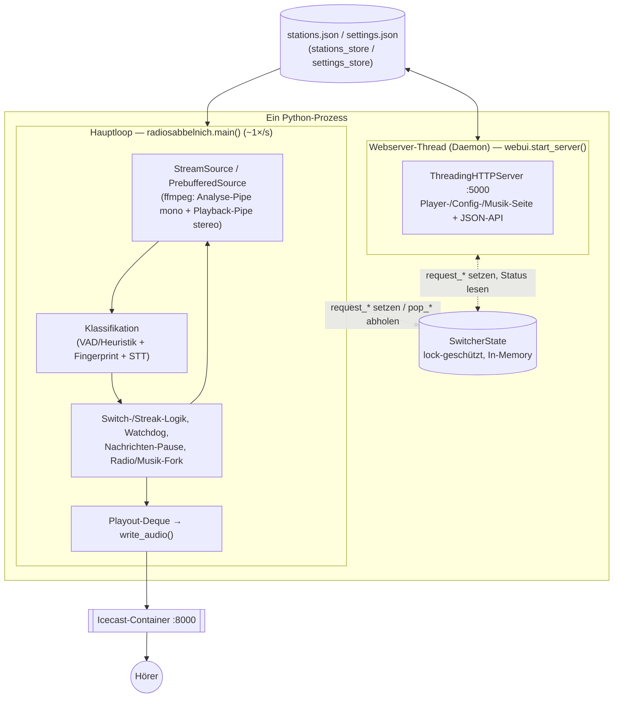
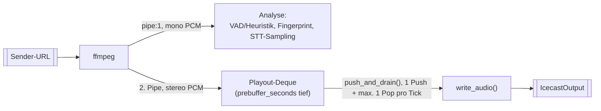
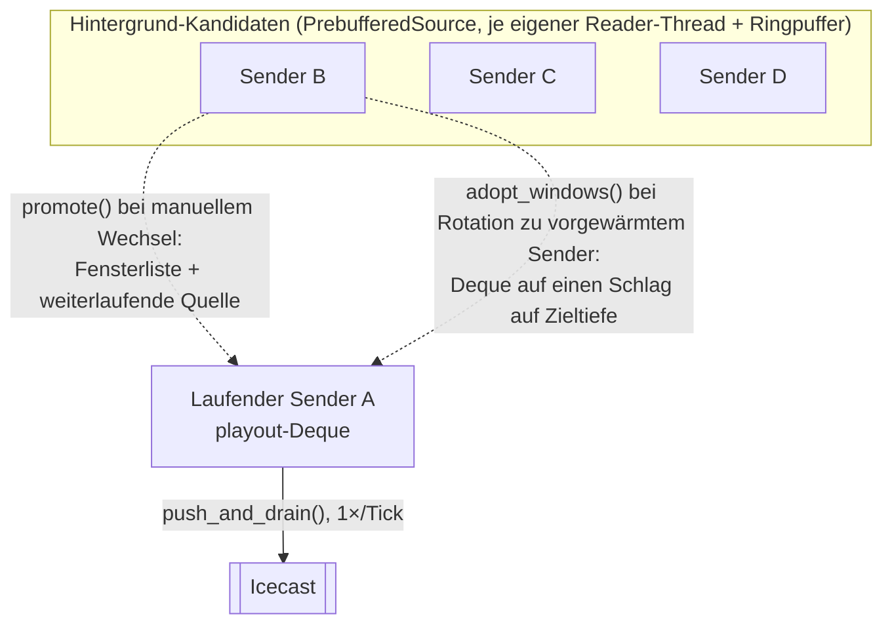
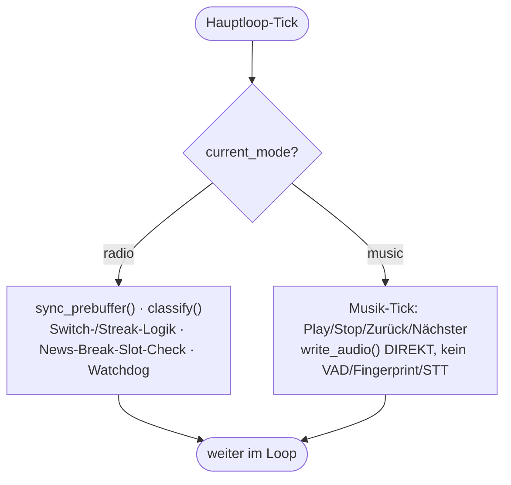
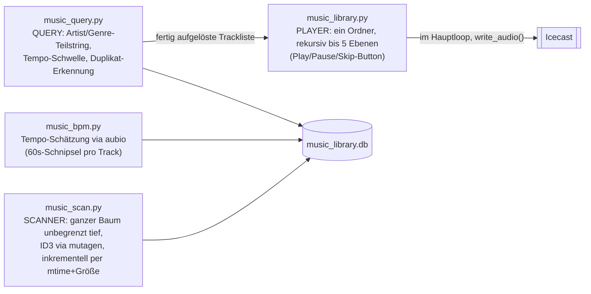
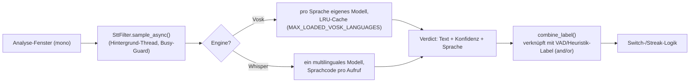
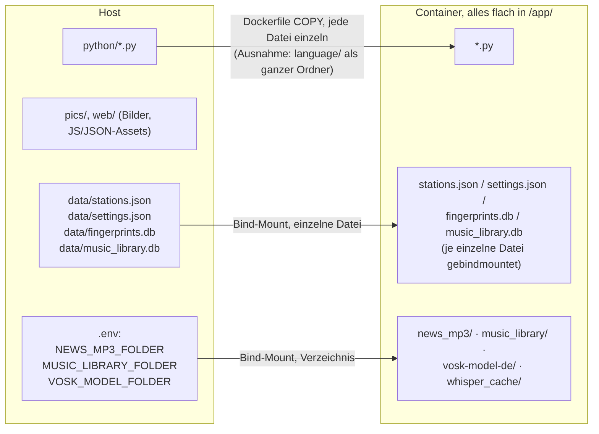

# Architektur

Dieses Dokument bündelt die Architektur von RadioSabbelNich an einer Stelle,
mit grafischen Übersichten. Es ersetzt nicht die Detailtiefe in `CLAUDE.md`
(dort stehen zusätzlich die harten Begründungen "warum genau so und nicht
anders", relevant beim Ändern von Code) und nicht `SESSION.md` (dort steht
die chronologische Historie samt Messwerten). Nutzerorientierte Bedienung/
Konfiguration steht in `README.md`. Dieses Dokument ist der Einstiegspunkt,
wenn man sich einen Überblick verschaffen will, bevor man in Details geht.

## Gesamtbild

Ein einziger Python-Prozess, zwei Akteure, geteilter In-Memory-Zustand —
kein IPC, kein Datei-Polling zwischen den beiden:

**Kommunikationsmuster request/pop**: der Webserver-Thread setzt ein Flag
(`request_switch`, `request_reload`, `request_skip`,
`request_music_play/_stop/_skip`, …), der Hauptloop holt es einmal pro
Durchlauf ab (`pop_*`) und führt die Aktion aus. Grund: nur der Hauptloop
darf `source`/`current` und die Streak-Buchhaltung anfassen — direktes
Umschalten aus dem Webserver-Thread würde Puffer-Übergabe und Sprach-Streak
inkonsistent machen. Reine Status-Werte (STT-Status, Sprachwahrscheinlichkeit
fürs "Bullshitometer") laufen einfacher als Setter/Property in die
Gegenrichtung, weil dort keine Aktion ausgelöst wird, nur eine Anzeige
gefüttert wird.

`stations.json`/`settings.json` sind die Quelle der Wahrheit, `SwitcherState`
ist nur ein Cache für die laufende Rotation. Sender werden immer über ihre
stabile `id` referenziert, nie über eine Listenposition.

## Audio-Pfad

Ein ffmpeg-Prozess pro Quelle, zwei Ausgänge — Analyse und Ausstrahlung
laufen parallel auf demselben Rohdaten-Strom, nicht nacheinander:

`read_window()` liest beide Pipes parallel per `select` — läuft eine voll,
blockiert ffmpeg und die andere bekommt auch nichts mehr. `IcecastOutput`
besteht über Senderwechsel hinweg (Hörer merkt keinen Verbindungsabbruch),
nur die `StreamSource` wird getauscht. Audio verlässt den Prozess
ausschließlich über `write_audio()` — `output.write()` direkt aufzurufen
würde die Playout-Deque umgehen.

## Prebuffering + Playout-Delay

Klassifikation passiert **vor** der Ausgabe, nicht danach: ein frisches
Fenster wird hinten an die `playout`-Deque angehängt, sofort klassifiziert,
und erst wenn die Deque über `prebuffer_seconds` hinausgewachsen ist, wird
vorne das älteste Fenster ausgegeben. Ein Push, höchstens ein Pop pro
Durchlauf — dadurch bleibt die Ausgabe im Realzeit-Takt.

Wechsel zu einem **vorgewärmten** Kandidaten übernimmt dessen komplette
Fensterliste auf einen Schlag (`adopt_windows()`) — sofort auf Zieltiefe,
kein Bridge-Timing nötig. Wechsel zu einem **nicht vorgewärmten** Sender
(`reset_playout()`) schaltet auf reinen Passthrough (kein Delay) — ein
lückenloser Sprung von 0 auf volle Verzögerung ist ohne Zeitdehnung nicht
möglich, deshalb bewusst als Grenze akzeptiert (selten: nur außerhalb der
nächsten `prebuffer_count` Sender oder im Notfall). Regeln, die dabei
niemals gebrochen werden dürfen: genau ein Leser pro Pipe (sonst wird die
Quelle als `dead` verworfen), `pb.stop()` blockiert den Hauptloop bis zu
~9 s (deshalb keine weiteren blockierenden Operationen in
`sync_prebuffer()`), und Audio verlässt den Prozess ausschließlich über
`write_audio()`.

## Watchdog gegen tote Sender

`dead_until` (Sender-ID → Ablaufzeitpunkt) wird aus drei Quellen gespeist:
zu viele leere Reads des laufenden Senders, ein im Hintergrund gestorbener
Puffer, oder ein Kandidat, der beim Durchprobieren nichts liefert. Gesperrte
Sender fallen aus Rotation und Pufferzielen raus, der laufende Sender bleibt
aber immer drin, damit Pufferpositionen nicht verrutschen. Manuelles
Umschalten hebt eine Sperre auf; sind alle Sender gesperrt, werden alle
Sperren verworfen statt hängenzubleiben. Ohne diesen Mechanismus legte
historisch ein einziger toter Sender den Player für 8,5 Stunden still.

## Radio-/Musik-Modus (Top-Level-Fork)

Der Musik-Modus ist **kein** Sonderfall der Nachrichten-Pause (die pausiert
nur einen einzelnen Sender kurz und kehrt automatisch zurück), sondern ein
persistenter Top-Level-Zustand ganz oben im Hauptloop:

Solange `current_mode == "music"` ist, laufen VAD/STT/Fingerprint/
News-Break-Prüfung/Watchdog schlicht nicht — nicht nur pausiert, komplett
aus. Der Wechsel radio→music stoppt die Radio-Quelle und räumt alle
Hintergrund-Puffer ab; music→radio verbindet frisch zum letzten
`current`-Sender. Der Modus wird in `settings.json` persistiert, bevor die
Bestätigung an die Web-UI geht (kein Fenster für "UI zeigt neuen Modus,
Neustart würde aber alten wiederherstellen"). Programmstart fährt immer erst
bedingungslos als Radio hoch und räumt danach einmalig auf, falls
`current_mode` bereits `"music"` war — ein einzelner Startpfad ist weniger
fehleranfällig als zwei. Beim (Wieder-)Eintritt in den Player-Modus startet
automatisch Track 0 des konfigurierten Ordners (`start_folder_playback()`) —
kein Persistieren der exakten Position, jeder Einstieg beginnt alphabetisch
vorn.

## Musik-Library-Baukasten

Vier Module mit klar getrennten Zuständigkeiten — kein Modul kennt die
Aufgabe der anderen:

Scan und Query laufen **ausschließlich aus dem Webserver-Thread** (eigene,
kurzlebige SQLite-Connections — sqlite3 ist nicht thread-übergreifend
sicher); der Hauptloop bekommt beim Query-Play nur die fertige Trackliste
durchgereicht, der ~1s-Analysetakt darf nie auf eine Query warten. Cover
werden als Dateien gecacht (Dateiname = SHA1 des relativen Pfads), nicht als
Blob in der DB. `audio_tags.py` ist eine format-übergreifende
Tag-Abstraktion (MP3/FLAC/OGG/M4A/AAC/WAV/APE), gemeinsam genutzt von
`music_scan.py` (Scan) und dem Hauptloop (Live-Anzeige "gerade läuft" für
News-Break und Musik-Player).

## STT-Sprachfilter

Zusätzliches Signal per Speech-to-Text, unabhängig von VAD/Fingerprint —
wo VAD nur "menschliche Stimme" erkennt (Gesang zählt mit), prüft STT den
Inhalt (kommt zusammenhängender Text in der erwarteten Sprache?):

Die erwartete Sprache hängt an der **Kategorie** des laufenden Senders
(`settings_store.resolve_stt_language()`), nicht am einzelnen Sender.
Sampling läuft kontinuierlich (nicht nur bei VAD-Label "speech"), sonst wäre
`combine_mode="or"` wirkungslos — pausiert nur während `news_break_active`
und wenn der Filter global deaktiviert ist. Ohne (passenden/frischen) Befund
ist `combine_label()` ein reines No-Op und gibt das VAD-Label unverändert
zurück — dadurch deaktiviert sich das Feature bei einem Modell-Ladefehler
faktisch selbst. Konfidenzwerte sind Best-Effort-Proxys, kein kalibriertes
Wahrscheinlichkeitsmaß; ein geführter Kalibrierungs-Wizard
(`_calibration`-Session in `SwitcherState`) hilft bei der Schwellwertwahl
pro Sprache.

## Mehrsprachiges Web-Interface

`i18n.py` ist reine Domänenlogik, übersetzt ausschließlich das, was der
Nutzer im Browser sieht — Logs/Fehlermeldungen bleiben deutsch. Englisch ist
seit 2026-08-12 die im Code eingebettete Basissprache (`_BASE_STRINGS`,
immer vollständig); weitere Sprachen kommen als externe `.lng`-Sprachpakete
aus `language/` (Key=Value, muss nicht vollständig sein — fehlende Keys
fallen pro Key auf Englisch zurück). Beide Templates (`_PAGE_HTML`/
`_CONFIG_PAGE_HTML`) bleiben je ein Quelltext mit `data-i18n*`-Attributen,
einmal pro Sprache beim Modul-Import vorgerendert (`_render_i18n_variants()`)
statt pro Request neu ersetzt. Eine Start-Prüfung
(`_check_i18n_coverage()`) gleicht alle im Markup verwendeten Keys gegen
`i18n.STRINGS` ab und wirft beim Start, falls ein Key fehlt — ersetzt das
fehlende Test-Framework für diesen einen Aspekt.

## Docker: Host- vs. Container-Layout

Host-Layout und Container-Layout sind bewusst entkoppelt — im Container
landet unabhängig von der Host-Ordnerstruktur alles flach in `/app/`:

Wichtige Konsequenz der Einzeldatei-Bind-Mounts: `stations_store._write()`
schreibt direkt statt über `os.replace()` — ein Rename über einen
Mountpoint scheitert mit "Device or resource busy" ("atomares Schreiben"
ist hier also bewusst NICHT umgesetzt). Neue `.py`-Module müssen einzeln in
den Dockerfile-`COPY`-Zeilen eingetragen werden, sonst fehlen sie im Image.

## TLS/HTTPS (optional)

Web-Interface und Icecast bekommen TLS auf grundverschiedene Art: das
Web-Interface liest `tls_enabled` aus `settings.json` und wickelt sein
Server-Socket beim Start optional in `ssl.SSLContext` ein (wirkt erst nach
Container-Neustart, kein Parallelbetrieb Klartext+TLS auf demselben Port).
Icecast läuft in einem separaten Drittanbieter-Container ohne Python-Code —
gesteuert rein über `.env` (`TLS_CERT_FILE`/`TLS_KEY_FILE`), die
`docker-compose.yml`-Startzeile patcht bei Bedarf einen **zusätzlichen**
SSL-`<listen-socket>` in die generierte `icecast.xml`, der bestehende
Klartext-Port bleibt unverändert bestehen.

## Sicherheitsmodell

**Kein Auth, nur hinter VPN.** Web-Interface und Config-Seite haben keinerlei
Authentifizierung, der Restream ist urheberrechtlich nur privat tragbar.
Keine Änderungen, die auf öffentliche Erreichbarkeit hinauslaufen
(Port-Forwarding, öffentlicher Reverse-Proxy).

## Weiterführend

- **`README.md`** — Nutzersicht: Setup, Bedienung, Konfigurationswerte,
  vollständige Datei-Tabelle.
- **`CLAUDE.md`** — dieselben Themen in voller Tiefe samt der harten
  Begründungen, warum ein naheliegender Ansatz nachweislich nicht
  funktioniert hat; Pflichtlektüre vor Codeänderungen an diesen Bereichen.
- **`SESSION.md`** — chronologisches Arbeitsprotokoll mit echten
  Messwerten pro Arbeitseinheit.
- **"Bekannte offene Punkte"** in `CLAUDE.md` — aktueller Stand offener
  Baustellen (Prebuffering-Blockierung, fehlender Stream-Health-Status,
  ungeprunte Fingerprint-DB, u.a.).
