# Architektur

## Inhaltsverzeichnis

- [Gesamtbild](#gesamtbild)
- [Audio-Pfad](#audio-pfad)
- [Prebuffering + Playout-Delay](#prebuffering--playout-delay)
- [Watchdog gegen tote Sender](#watchdog-gegen-tote-sender)
- [Sprache-Erkennung (VAD, speech_detector.py)](#sprache-erkennung-vad-speech_detectorpy)
- [Fingerprinting](#fingerprinting)
- [Song-Erkennung (song_fingerprint.py)](#song-erkennung-song_fingerprintpy)
- [Logging](#logging)
- [Sender-Import](#sender-import)
- [Nachrichten-Pause (news_break.py)](#nachrichten-pause-news_breakpy)
  - [Werbeblock-Vorbuffering (ad_skip_prebuffer.py, seit 2026-08-21)](#werbeblock-vorbuffering-ad_skip_prebufferpy-seit-2026-08-21)
  - [Sprache-Gate für den Pause-Start (seit 2026-08-21)](#sprache-gate-für-den-pause-start-seit-2026-08-21)
- [Radio-/Musik-Modus (Top-Level-Fork)](#radio-musik-modus-top-level-fork)
- [Musik-Library-Baukasten](#musik-library-baukasten)
- [STT-Sprachfilter (stt_filter.py)](#stt-sprachfilter-stt_filterpy)
- [Mehrsprachiges Web-Interface (i18n.py)](#mehrsprachiges-web-interface-i18npy)
- [Automatische Update-Prüfung (update_check.py)](#automatische-update-prüfung-update_checkpy)
- [Docker: Host- vs. Container-Layout](#docker-host--vs-container-layout)
- [TLS/HTTPS (optional, `TLS_CERT_FILE`/`TLS_KEY_FILE` in `.env`)](#tlshttps-optional-tls_cert_filetls_key_file-in-env)
- [Sicherheitsmodell](#sicherheitsmodell)
- [Offene Punkte](#offene-punkte)

Dieses Dokument ist die **einzige, vollständige** Beschreibung der
RadioSabbelNich-Architektur — Diagramme und die dazugehörigen
Begründungen ("warum genau so, warum ein naheliegender Ansatz
nachweislich nicht funktioniert hat") stehen **nur hier**, nicht mehr
zusätzlich in `CLAUDE.md`. Wer an einem der unten genannten Module
arbeitet, liest den passenden Abschnitt **vor** der Änderung.

Abgrenzung zu den anderen Doku-Dateien (hierarchisch, keine
Doppelung — jede Information hat genau einen Ort):

- **`README.md`** — Nutzersicht: was das Projekt tut, Setup, Bedienung,
  Konfigurationswerte, vollständige Datei-Tabelle. Kein Architektur-Wissen.
- **`ARCHITECTURE.md`** (dieses Dokument) — wie und warum das System so
  gebaut ist, inklusive aller offenen/bekannten Baustellen.
- **`CLAUDE.md`** — Meta-Regeln fürs Arbeiten in diesem Repo (Sprache,
  Doku-Pflege, Versionierung, Test-Muster ohne Live-Deployment
  anzufassen, Sicherheitspolicy). Verweist für Architektur hierher,
  enthält selbst keine architekturbeschreibenden Inhalte mehr.
- **`SESSION.md`** — chronologisches Arbeitsprotokoll mit echten
  Messwerten pro Arbeitseinheit; die Historie *hinter* den hier
  beschriebenen Entscheidungen.

## Gesamtbild

Ein einziger Python-Prozess, zwei Akteure, geteilter In-Memory-Zustand —
kein IPC, kein Datei-Polling zwischen den beiden:

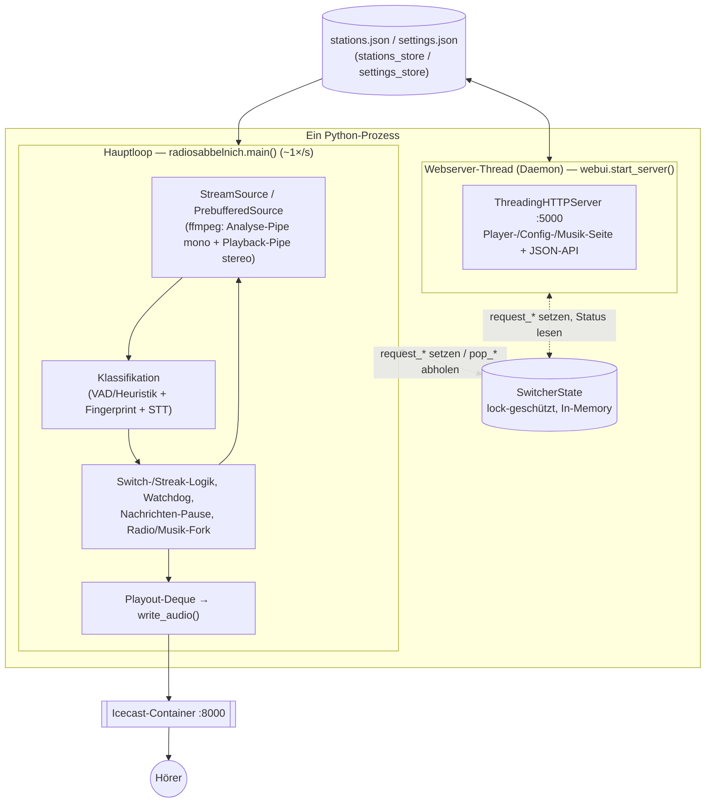

**Kommunikationsmuster request/pop**: der Webserver-Thread setzt ein Flag
(`request_switch`, `request_reload`, `request_skip`,
`request_music_play/_stop/_skip`, `request_filter_toggle`,
`request_mode_change`, …), der Hauptloop holt es einmal pro Durchlauf ab
(`pop_*`) und führt die Aktion aus. Grund: nur der Hauptloop darf
`source`/`current` und die Streak-Buchhaltung anfassen — direktes
Umschalten aus dem Webserver-Thread würde Puffer-Übergabe und Sprach-Streak
inkonsistent machen. Reine Status-/Info-Werte, die nur der Hauptloop kennt
und die Web-UI nur anzeigt (kein Auslösen einer Aktion), laufen dagegen
einfach als Setter/Property in die Gegenrichtung — `set_stt_status()`,
`set_speech_probability()` (Rohwert der Klassifikation fürs
"Bullshitometer" auf der Startseite). Ein dritter, noch einfacherer Fall
ist `host_paths` (Konstruktor-Parameter von `webui.start_server()`, NICHT
Teil von `SwitcherState`): rein statische Werte aus `.env`
(`NEWS_MP3_FOLDER_HOST`/`VOSK_MODEL_FOLDER_HOST`), einmalig beim Start
durchgereicht, damit die Config-Seite den echten Host-Pfad neben dem
Container-Pfad anzeigen kann — der Container kennt den Host-Pfad sonst
grundsätzlich nicht (Docker übersetzt Host→Container-Pfad nur einmalig
beim Anlegen des Containers). Deshalb gibt es dafür bewusst keinen
Auswahl-/Browse-Dialog: der könnte ohnehin nur Container-Pfade zeigen,
echter Host-Zugriff gäbe es nur über volle Host-Filesystem- oder
Docker-Socket-Freigabe — beides ein Sicherheitsrückschritt angesichts des
authlosen Web-Interfaces (siehe "Sicherheitsmodell" unten).

`stations.json`/`settings.json` sind die Quelle der Wahrheit,
`SwitcherState` ist nur ein Cache für die laufende Rotation. Deshalb liest
die Config-Seite bewusst frisch von der Platte
(`GET /api/config/stations` → `stations_store.load_all()`), während der
Hauptloop erst beim nächsten `pop_reload_request()` nachzieht. Sender
werden immer über ihre stabile `id` referenziert, nie über eine
Listenposition — Rotationsreihenfolge ist "aktivierte Sender alphabetisch
nach Name". Hinzufügen/Löschen/Deaktivieren darf die laufende Wiedergabe
nicht durcheinanderbringen.

## Audio-Pfad

Ein ffmpeg-Prozess pro Quelle, zwei Ausgänge — Analyse und Ausstrahlung
laufen parallel auf demselben Rohdaten-Strom, nicht nacheinander:

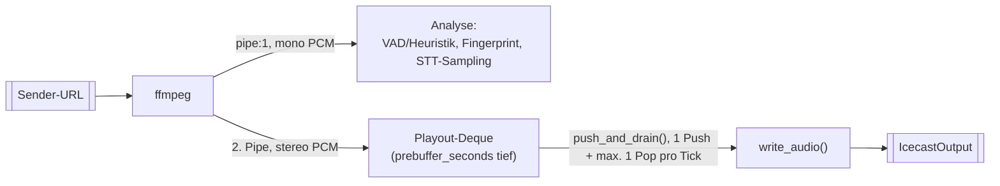

`read_window()` liest beide Pipes parallel per `select` — läuft eine voll,
blockiert ffmpeg und die andere bekommt auch nichts mehr (der Timeout dort
verhindert nur, dass eine tote Quelle den einzelnen Read blockiert; gegen
die Endlosschleife drumherum hilft der Watchdog, siehe unten).
`IcecastOutput` besteht über Senderwechsel hinweg (Hörer merkt keinen
Verbindungsabbruch), nur die `StreamSource` wird getauscht. Analyse ist
mono, Ausstrahlung stereo — wer am Audio-Pfad arbeitet, muss beide Seiten
bedienen. Audio verlässt den Prozess ausschließlich über `write_audio()`
(aufgerufen aus `push_and_drain()` bzw. direkt aus `quick_forward()` im
Passthrough-Fall) — `output.write()` direkt aufzurufen würde die
Playout-Deque komplett umgehen.

**VU-Meter im Web-Interface (seit 2026-08-20):** rein lesend auf dem
bereits gelesenen `pcm`-Mono-Array obendrauf, ohne `read_window()`/die
Pipe-Timing-Logik selbst anzufassen. `sub_window_dbfs()` zerlegt das
1-Sekunden-Fenster in `VU_SLICES_PER_WINDOW` (10) Teilstücke und liefert
pro Teilstück den RMS-Pegel (`window_dbfs()`, ursprünglich für den
Totluft-Watchdog gebaut). Der Hauptloop reicht die Liste an
`state.set_audio_levels()` durch (kein `_version`-Bump — kontinuierlicher
Wert, gleiches Muster wie `speech_probability`), `/api/status` liefert sie
als `audio_levels_dbfs`. Läuft im **Radio-** UND im **Musik-Zweig** (beide
lesen `pcm` über dieselbe `StreamSource.read_window()`), im Radio-Zweig
bewusst außerhalb des `news_break_active`-Gates des Totluft-Watchdogs —
der Pegel soll auch während einer News-Break-MP3 aktualisiert werden.
Frontend-seitig animiert ein 100ms-Tick durch die 10 Werte, damit sich der
Balken trotz nur 1×/Sekunde eintreffender Daten flüssig bewegt, statt
1×/Sekunde zu springen.

## Prebuffering + Playout-Delay

`PrebufferedSource` hält pro Sender eine eigene `StreamSource` plus
Reader-Thread und einen Ringpuffer der letzten `prebuffer_seconds`
Sekunden (fenstergenau: zwei parallele Deques mit `maxlen`, kein
konkateniertes Array). Seit 2026-08-06 ist dieser Puffer nicht nur ein
Vorrat für die Wechsel-Übergabe, sondern gleichzeitig ein echtes
**Playout-Delay** für den GERADE laufenden Sender: Klassifikation passiert
dadurch **vor** der Ausgabe, nicht danach — ein frisches Fenster wird
hinten an die `playout`-Deque angehängt, klassifiziert, und erst wenn die
Deque über `prebuffer_seconds` hinausgewachsen ist, wird vorne das älteste
Fenster ausgegeben. Ein Push, höchstens ein Pop pro Durchlauf — dadurch
bleibt die Ausgabe im Realzeit-Takt.

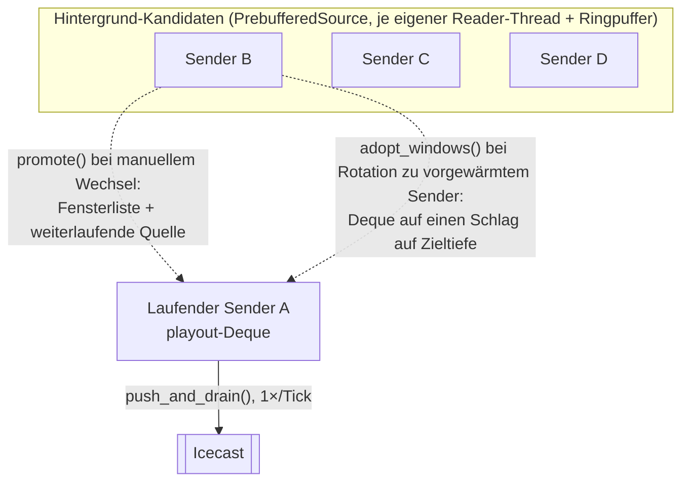

Wechsel zu einem **vorgewärmten** Kandidaten übernimmt dessen komplette
Fensterliste auf einen Schlag (`adopt_windows()`) — sofort auf Zieltiefe,
Drain läuft ab dem nächsten Fenster ohne Lücke weiter, kein Bridge-Timing
nötig (die frühere `promote_bridge()`/`stereo_tail()`-Mechanik ist damit
komplett entfallen). Wechsel zu einem **nicht vorgewärmten** Sender
(`reset_playout()`) schaltet auf reinen Passthrough (kein Delay, sofortige
Ausgabe) — ein lückenloser Sprung von 0 auf volle Verzögerung ist ohne
Zeitdehnung nicht möglich, deshalb bewusst als Grenze akzeptiert. Diese
Fälle sind selten (nur außerhalb der nächsten `prebuffer_count` Sender in
der Rotation oder im Notfall, wenn alle Kandidaten-Puffer selbst tot sind).

Drei harte Regeln bei `PrebufferedSource`:

1. **Eine Pipe hat genau einen Leser.** `promote()`/`stop()` joinen den
   Reader-Thread; überlebt er den Join, wird die Quelle als `dead`
   markiert und verworfen statt übernommen.
2. **`pb.stop()` blockiert den Hauptloop** (bis ~9 s pro Quelle, weil es
   auf ein laufendes `read_window()` wartet). `sync_prebuffer()` läuft
   einmal pro Durchlauf — dort keine weiteren blockierenden Operationen
   einbauen.
3. **Audio verlässt den Prozess ausschließlich über `write_audio()`**
   (siehe Audio-Pfad oben).

`sync_prebuffer()` startet gestorbene Puffer **nicht** selbst neu, sondern
gibt deren IDs zurück; der Hauptloop sperrt sie (siehe Watchdog) — sonst
gäbe es bei einer dauerhaft toten URL einen ffmpeg-Spawn pro Sekunde.

Ändert sich `prebuffer_seconds`/`prebuffer_count` über `/config` während
die `playout`-Deque primed ist, wird sie verworfen (Reset auf Passthrough)
statt auf die neue Zieltiefe umgerechnet — aus demselben Grund wie oben
(kein gapless Übergang zwischen zwei Zieltiefen). Die Nachrichten-Pause
resettet die Deque ebenfalls explizit (siehe unten).

## Watchdog gegen tote Sender

`dead_until` (Sender-ID → Ablaufzeitpunkt) im Hauptloop wird aus vier
Quellen gespeist: `STREAM_FAILURE_LIMIT` leere Reads des laufenden
Senders, anhaltende Stille des laufenden Senders (s.u.), ein im
Hintergrund gestorbener Puffer, oder ein Kandidat, der beim
Durchprobieren nichts liefert. `alive_stations()` filtert gesperrte
Sender aus Rotation und Pufferzielen; `keep_id` hält den laufenden Sender
drin, damit nicht alle Pufferpositionen verrutschen. Manuelles Umschalten
hebt die Sperre auf, und sind *alle* Sender gesperrt, werden die Sperren
verworfen statt hängenzubleiben. `mark_dead_and_switch()` bündelt "sperren
+ ggf. alle Sperren aufheben + weiterschalten" für beide unten
beschriebenen Watchdog-Zweige an einer Stelle.

Ohne diesen Mechanismus legte historisch ein einziger toter Sender den
Player für 8,5 Stunden still — Grund, warum Switch-Logik und Pufferung
diese Pfade immer mitdenken müssen.

**Totluft-Erkennung (seit 2026-08-20):** Der Leere-Reads-Zähler oben
erkennt nur, wenn eine Quelle *gar keine* Daten mehr liefert. Ein Sender
kann aber technisch einwandfrei verbunden bleiben und trotzdem nur noch
Stille/Rauschen senden (senderseitiges Problem, real beobachtet bei
Hamburg Zwei) — dagegen hilft der Leere-Reads-Check nicht, `pcm.size`
bleibt > 0. Deshalb misst `window_dbfs()` den RMS-Pegel jedes
Analysefensters; bleibt er `SILENCE_DURATION_LIMIT` (30s) am Stück unter
`SILENCE_DBFS_THRESHOLD` (-50dBFS), greift derselbe `dead_until`-
Mechanismus wie beim Leere-Reads-Watchdog. Schwelle/Dauer bewusst
grosszügig gewählt (gemessen: normaler Sender ~-18dBFS im Mittel, eine
real beobachtete Totluft-Quelle durchgehend ~-75dBFS) — eine kurze
Sprechpause oder ein leiser Songausklang soll keinen Fehlalarm auslösen.
Läuft während einer Nachrichten-Pause (`news_break_active`), ist der
Check ausgesetzt: `current` zeigt dabei weiter auf den *pausierten* echten
Sender, eine leise Stelle in der News-MP3 darf den nicht fälschlich als
tot markieren. Bewusst NICHT gemacht: Kandidaten beim Durchprobieren in
`do_switch()` auf Stille zu prüfen (nur auf Sprache) — trifft die
Auto-Suche doch einmal eine ebenfalls stille Quelle, korrigiert sich das
von selbst beim nächsten Durchlauf des Totluft-Watchdogs, zusätzliche
Komplexität an der Stelle schien den Nutzen nicht wert.

## Sprache-Erkennung (VAD, speech_detector.py)

`SpeechDetector` ist eine einzige, im Hauptloop gehaltene Instanz um
Silero VAD herum (`classify()`-Closure in `main()`, Fallback auf die
Signal-Heuristik `classify_window()`, falls `silero-vad-lite` fehlt oder
scheitert). **Jeder echte Wechsel des klassifizierten Audiostroms ruft
`detector.reset()` auf**, bevor das erste Fenster des neuen Stroms
klassifiziert wird — bei `switch_to_station()`, in `do_switch()` vor jeder
Kandidaten-Klassifikation (gepuffert wie frisch), beim Rekonnekt nach
Stream-Ausfall und beim Musik→Radio-Übergang. Zwei unabhängige Gründe,
warum das nötig ist, nicht nur einer:

1. `self.leftover` sind Resample-Reste des vorigen Fensters — ohne Reset
   landen sie im ersten Fenster des neuen Streams und verzerren dessen
   erste VAD-Auswertung.
2. `SileroVAD.process()` hält zusätzlich einen rekurrenten Modellzustand
   über aufeinanderfolgende `process()`-Aufrufe, den die C-Erweiterung
   NICHT über eine eigene `reset()`-Methode freigibt — der einzige Weg,
   ihn loszuwerden, ist ein frisches `SileroVAD`-Objekt (klein/billig
   genug für einen Reset pro Streamwechsel).

Ohne (2) würde eine reine `leftover`-Bereinigung nicht reichen — ein
naheliegender Ansatz, der bei genauerem Blick in die Bibliotheks-API
nicht funktioniert hätte. Relevant vor allem, sobald mehr als ein
Audiostrom gleichzeitig klassifiziert wird (z.B. ein zusätzlicher
Hintergrund-Detector): der muss eine EIGENE `SpeechDetector`-Instanz
bekommen, kein Teilen der Hauptloop-Instanz — sonst vermischen sich
Leftover/Modellzustand beider Ströme.

## Fingerprinting

`fingerprint.py` lernt jeden Sprach-Clip, der keinen Treffer erzeugt — die
DB wächst also im Betrieb (kein Pruning, siehe "Offene Punkte" unten).
Matching läuft per Constellation-Map mit Delta-Konsistenz;
`MIN_HASH_MATCHES` trennt echte Treffer (gemessen: hunderte) von
Zufallstreffern (gemessen: ≤7). Die `FingerprintDB`-Connection gehört dem
Hauptloop; `delete_clip()`/`clear_all()` öffnen aus dem Webserver-Thread
bewusst eigene kurzlebige Connections, weil sqlite3-Connections nicht
thread-übergreifend sicher sind — dasselbe Muster wie bei
`music_query.py`/`music_scan.py` (siehe Musik-Library-Baukasten unten).

## Song-Erkennung (song_fingerprint.py)

Phase 1: erkennt WIEDERHOLTE Musikstücke per lokalem Chromaprint-
Fingerprint-Cache. Phase 2 (seit diesem Abschnitt): identifiziert einen bei
Phase 1 unbekannten Song optional per AudD-Cloud-Lookup
(`song_recognition.cloud_lookup_enabled` UND `AUDD_API_TOKEN` gesetzt, siehe
unten) — `on_unknown_fingerprint()` ist dafür kein reiner Logging-Stub mehr.
Komplett getrennt von `fingerprint.py`/`fingerprints.db` oben: andere
Domäne (Musikstücke statt wiederkehrende Sprache-Clips/Jingles), eigene
DB-Datei (`song_fingerprints.db`), eigenes Matching-Verfahren.

**`song_recognition.enabled` defaultet auf `false` UND fehlt trotzdem oft
als Key in einer bestehenden `data/settings.json`** — das ist kein Bug,
sondern dasselbe Verhalten wie bei jedem anderen `DEFAULTS`-Unterblock in
`settings_store.py` (`news_break`/`stt_filter`/`music_library`):
`_read_raw()` schreibt die Datei nur beim allerersten Fehlen komplett neu
(`if not os.path.exists(...): _write(DEFAULTS)`) — eine schon vorher
existierende `settings.json` bekommt einen neu hinzugekommenen Top-Level-
Key nie automatisch nachgetragen, der Default lebt nur im In-Memory-Merge
(`_defaults_copy()` + Merge-Loop). Live erlebt (siehe SESSION.md
2026-08-24): das sah beim Debugging erst nach einem stillen Fehler aus
("Key fehlt komplett in settings.json"), war aber genau dieses erwartete
Verhalten — betrifft künftig JEDEN neuen `settings_store`-Unterblock,
nicht nur diesen. Seit demselben Datum loggt `main()` deshalb beim Start
zusätzlich explizit "Song-Erkennung: aktiv/inaktiv" (statt nur den
DB-Pfad wie zuvor), damit der aktive/inaktive Zustand nicht erst über
`settings.json` oder Log-Rotations-Archäologie rekonstruiert werden muss.

Dem Diagramm unten vorgeschaltet: das Hörer-Gate (siehe unten) — ohne
Hörer auf dem Restream-Mount passiert hier gar nichts, auch `feed()` wird
dann nicht aufgerufen.

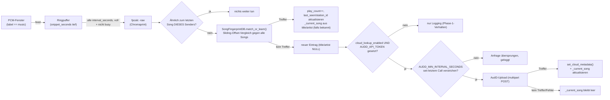

Warum Chromaprint statt desselben Constellation-Map-Eigenbaus wie
`fingerprint.py`: Sprache-Clips/Jingles werden dort immer vom Anfang an neu
mitgeschnitten (Trigger ist ein frischer Sprache-Lauf), zwei Aufnahmen
desselben Songs im Radio starten dagegen fast nie an derselben Stelle im
Song. Chromaprint ist genau für robuste Ausschnitts-Fingerprints gebaut,
ein eigenes Constellation-Map-Verfahren dafür neu zu entwickeln wäre eine
deutlich größere Baustelle als das vorhandene Kompilat (`fpcalc`, Debian-
Paket `libchromaprint-tools`) zu nutzen.

`fpcalc -raw -json` liefert nur das rohe Chromaprint-Integer-Array, KEINEN
fertigen Ähnlichkeits-Score. Das eigentliche Matching (`similarity()` in
`song_fingerprint.py`) ist bewusst eigener, simpler Python-Code (nur
`subprocess` + stdlib Bit-Operationen) statt einer zusätzlichen
pip-Abhängigkeit wie `pyacoustid` — aus demselben Grund wie bei
`fingerprint.py`: in Python+SQLite komplett selbst verständlich und
wartbar. Weil zwei Aufnahmen desselben Songs an unterschiedlichen Stellen
im Song anfangen können, vergleicht `similarity()` nicht Index-für-Index,
sondern probiert mehrere Zeitverschiebungen zwischen den beiden Arrays
durch (Sliding-Offset-Suche, begrenzt auf `MAX_OFFSET`) und nimmt die beste
Hamming-Ähnlichkeit — das dokumentierte Funktionsprinzip hinter
Chromaprint-basiertem Matching.

Anders als `FingerprintDB` (deren Connection dem Hauptloop-Thread gehört,
weil `match_or_learn()` dort SYNCHRON läuft) öffnet `SongFingerprintDB`
für JEDEN Aufruf eine eigene kurzlebige Connection statt eine dauerhafte zu
halten: `match_or_learn()` läuft hier IMMER im Hintergrund-Thread von
`SongRecognizer` (siehe unten), eine vom Hauptloop-Thread erzeugte
Connection dürfte sqlite3 zufolge nicht aus einem anderen Thread benutzt
werden ("SQLite objects created in a thread can only be used in that same
thread" — live beim Testen aufgetreten, kein theoretisches Risiko).

`SongRecognizer` sammelt PCM-Fenster nur, solange `label == "music"` ist
(Aufrufer im Hauptloop entscheidet das), und stößt die eigentliche
Chromaprint-Berechnung asynchron an — Async-Muster 1:1 von
`SttFilter.sample_async()` übernommen (Lock + `_busy`-Guard, kein
Thread-Stapeln, falls `fpcalc` mal länger braucht als `interval_seconds`).
`interval_seconds`/`similarity_threshold` werden bei jedem Aufruf frisch
aus `settings.json` gelesen (wirken ohne Neustart, wie
`stt_filter.confidence_threshold`); `snippet_seconds` legt dagegen nur beim
Prozessstart die Tiefe des Ringpuffers fest — eine Änderung braucht wie bei
`tls_enabled` einen Container-Neustart.

**Reset an jedem echten Streamwechsel ist Pflicht, nicht optional**: an
JEDER Stelle im Hauptloop, an der auch `detector.reset()` läuft (echter
Senderwechsel, Rekonnekt nach Stream-Ausfall, Musik→Radio-Übergang — sechs
Stellen, siehe `SpeechDetector.reset()`-Docstring), läuft auch
`song_recognizer.reset()`. Ohne das würde der Ringpuffer Audio zweier
verschiedener Sender vermischen (ein Datenmüll-Fingerprint aus zwei
Songs), UND die Songwechsel-Erkennung würde den neuen Sender fälschlich
gegen den zuletzt gehörten Song des ALTEN Senders vergleichen — derselbe
Bug-Mechanismus wie beim ursprünglich gefixten "SpeechDetector
leftover"-Problem, hier auf ein zweites, unabhängiges Stück Zustand
angewendet. `stt_ring` (STT-Sampling) macht das bewusst NICHT: ein
einzelnes STT-Sample ist nicht positionssensitiv, ein kurzer Sendermix an
der Nahtstelle verzerrt dort kein Songwechsel-Urteil. Läuft automatisch nur
im Radio-Modus: `current_mode == "music"` überspringt `classify()` im
Hauptloop komplett (siehe "Radio-/Musik-Modus" unten), der Hook-Punkt
(`else`-Zweig bei `label != "speech"`) wird im Library-Modus dadurch nie
erreicht, kein Extra-Gate nötig.

**AudD-Cloud-Lookup (Phase 2, `audd_lookup()`/`on_unknown_fingerprint()`):**
läuft NUR bei einem lokalen Cache-Miss (Phase 1 hat bereits eine neue,
title/artist=NULL-Zeile angelegt) UND nur, wenn sowohl
`song_recognition.cloud_lookup_enabled` als auch `AUDD_API_TOKEN` (aus der
Umgebung, einmal beim Modul-Import gelesen — Grund: keine Secrets in
`settings.json`, das Web-Interface hat keine Auth, siehe CLAUDE.md) gesetzt
sind — fehlt eine der beiden Voraussetzungen, unverändertes Phase-1-
Verhalten (reines Logging). Kein neuer pip-Dependency: das WAV wird per
`wave`-Modul in einen `io.BytesIO` geschrieben (kein Temp-File nötig wie bei
`compute_fingerprint()`, da `urllib` kein Dateisystem-Objekt braucht), der
`multipart/form-data`-Body für den Datei-Upload wird von Hand gebaut
(`_multipart_encode()`) statt einer zusätzlichen Abhängigkeit wie
`requests` — gleiche Begründung wie beim Rest des Projekts
(`update_check.py`/`station_import.py` nutzen ebenfalls nur
`urllib.request`). Bei Erfolg schreibt `SongFingerprintDB.set_cloud_metadata()`
Titel/Interpret/Album/Jahr über den `fingerprint_hash`-Text in die von
`match_or_learn()` angelegte Zeile zurück. `title`/`artist` existierten als
Spalten bereits (waren nur immer `NULL`); `album`/`year` sind neu (Nutzer-
Wunsch, siehe SESSION.md) — Migration per `PRAGMA table_info()` +
`ALTER TABLE ... ADD COLUMN` in `_init_schema()`, identisches Muster wie
die `bpm`-Spalte in `music_scan.py` (SQLite kennt kein "ADD COLUMN IF NOT
EXISTS", `CREATE TABLE IF NOT EXISTS` allein reicht bei einer schon
bestehenden Tabelle nicht). Von AudD zusätzlich gelieferte Felder
(Streaming-Links, Label) werden weiterhin NICHT persistiert — kein
Anwendungsfall dafür. `match_or_learn()` liefert Album/Jahr/Länge auch bei
einem lokalen Hit mit (aus der DB, nicht erneut von AudD abgefragt) — ein
einmal per Cloud identifizierter Song zeigt sie deshalb bei jeder
Wiederholung weiter an, auch ganz ohne erneuten Cloud-Call.

**Songlänge (`duration_seconds`, Nutzer-Wunsch nachträglich ergänzt)**:
AudDs Kernantwort liefert KEINE Länge — nur mit dem zusätzlichen
Multipart-Feld `return=apple_music,spotify` (kostet keinen separaten
Request, nur mehr Felder in derselben Antwort) kommen zwei verschachtelte
Objekte mit je einem Millisekunden-Feld (live geprüft, siehe SESSION.md):
`result["spotify"]["duration_ms"]` bzw.
`result["apple_music"]["durationInMillis"]` — beide praktisch identisch
(Rundungsdifferenz im Bereich 1ms), Spotify bevorzugt, weil zuerst im
Response-JSON. `_parse_duration_seconds()` rundet auf ganze Sekunden.
Keins von beiden ist garantiert vorhanden (nicht jeder Song hat einen
Spotify-/Apple-Music-Treffer) — `duration_seconds` bleibt dann `None`,
genau wie Album/Jahr in diesem Fall.

**Sicherheitsnetz gegen Kontingent-Verbrauch**: `similarity_threshold` ist
weiterhin ein unkalibrierter Platzhalter (siehe unten) — greift er in der
Praxis zu locker/streng, könnte `match_or_learn()` denselben Song
wiederholt als "neu" einstufen und bei JEDEM Intervall einen bezahlten
AudD-Request auslösen. `AUDD_MIN_INTERVAL_SECONDS` (60s, Modulkonstante,
kein Settings-Wert — gleiche Kategorie wie `MAX_OFFSET`/`MIN_OVERLAP`)
erzwingt einen Mindestabstand zwischen Cloud-Calls, unabhängig davon, wie
oft `on_unknown_fingerprint()` aufgerufen wird.

**Live-Anzeige (`_current_song`, `SongRecognizer.get_current_song()`)**:
wird bei jedem lokalen Hit (aus dem in der DB gespeicherten title/artist,
kann dort weiterhin `None` sein, falls der Song nie per Cloud identifiziert
wurde) UND nach einem erfolgreichen AudD-Identify gesetzt, sonst (kein
Titel bekannt) auf `None` — lock-geschützt wie `_last_fingerprint`, aus
demselben Grund bei JEDEM `reset()` mitgeleert (echter Streamwechsel darf
nicht den Song des ALTEN Senders weiter anzeigen). `webui.py`s
`_build_status()` liest das im Radio-Zweig (`state.song_recognizer`, dort
registriert von `radiosabbelnich.py`s `main()`, analog `news_break_tags`/
`music_tags`) und befüllt `now_playing_tags` — derselbe Anzeige-Slot, den
News-Pause und Musiksammlung-Modus schon nutzen, keine neuen Templates/JS
nötig. Läuft `song_recognition.enabled`, aber `get_current_song()` liefert
`None`, bleibt `now_playing_tags` NICHT einfach `None` (Nutzer-Wunsch,
"zum Debuggen sichtbar statt still leer") — stattdessen ein Dict mit
`pending: true` (aktiv, wartet auf den nächsten Treffer) oder zusätzlich
`paused_no_listeners: true`, falls das Hörer-Gate unten gerade greift. Ohne
`enabled` bleibt es unverändert bei `None`, kein Anzeige-Rauschen für
Installationen ohne Song-Erkennung. Die JS-Seite (`applyStatus()`) rendert
das über zwei neue i18n-Keys (`idx_song_pending`/
`idx_song_paused_no_listeners`) in dieselbe Titel-Zeile, statt eines echten
Songtitels.

**Hörer-Gate (`ListenerGate`, Nutzer-Wunsch)**: Song-Erkennung (lokales
Fingerprinting UND Cloud-Lookup) läuft nur, solange
`ListenerGate.has_listeners()` `True` liefert — ohne Publikum auf dem
Restream-Mount kostet die Analyse CPU (fpcalc) bzw. AudD-Kontingent ohne
Gegenwert. Gate sitzt im Hauptloop VOR `song_recognizer.feed()` (siehe
`radiosabbelnich.py`), nicht in `song_fingerprint.py` selbst — spart damit
auch das Auffüllen des Ringpuffers, nicht nur den teuren Analyse-Schritt.
Pollt Icecasts `/admin/listclients`-Route (dieselbe Route/dieselben
`ICECAST_ADMIN_*`-Werte wie `webui._fetch_listeners()`, hier bewusst
eigenständig nachgebaut statt importiert — `song_fingerprint.py` bleibt ein
reines Audio-/Matching-Modul ohne HTTP-Server-Abhängigkeit) alle
`LISTENER_CHECK_INTERVAL_SECONDS` (60s) in einem eigenen Hintergrund-Thread,
NICHT synchron im Hauptloop — eine blockierende Netzwerk-Abfrage dort wäre
genau die Art Hauptloop-Stall, die der ganze Async-Aufbau in diesem Modul
vermeiden soll (vgl. `sync_prebuffer()`, "Offene Punkte" unten). Fail-open
bei fehlender Konfiguration, falschen Credentials oder Timeout — ein
Admin-API-Problem soll die Song-Erkennung nicht stillschweigend lahmlegen.
Erster Check verzögert (`LISTENER_CHECK_STARTUP_DELAY_SECONDS`, 15s): live
beim Rollout gefunden, dass ein Check direkt beim Konstruktor-Aufruf
(also VOR der eigentlichen Icecast-Source-Verbindung des Hauptloops) einen
noch nicht existierenden Mount abfragt — Icecast antwortet dafür mit
`400 Bad Request` statt einer leeren Hörerliste. Kein Funktionsfehler
(Fail-Open griff korrekt), aber unnötige Warnung bei jedem Start.

**"Stop" statt "Pause" (`on_change`-Callback, Nutzer-Korrektur nach dem
ersten Rollout)**: ein simples "bei 0 Hörern kein `feed()`/
`maybe_recognize_async()` mehr aufrufen" (erste Version dieses Features)
lässt den Ringpuffer mit dem Audio-Stand VOR dem Verschwinden der letzten
Hörer eingefroren stehen. Kommt später ein Hörer zurück, enthält der
Puffer dann fast ausschließlich veraltetes Vor-Pause-Audio (nur ein
einzelnes frisches Fenster kommt pro `feed()`-Aufruf dazu, der Puffer
braucht `snippet_seconds`, um sich komplett zu erneuern) — die erste
Analyse nach der Rückkehr liefe auf einem Frankenstein-Schnipsel aus zwei
Zeiträumen, potenziell ein sinnloser Fingerprint samt unnötigem AudD-Call.
`ListenerGate` bekommt deshalb einen optionalen `on_change`-Callback,
aufgerufen bei JEDEM tatsächlichen Wechsel des Hörer-Zustands (nicht bei
jedem Poll, nur beim Flip) — `radiosabbelnich.py` verdrahtet ihn so, dass
er bei "keine Hörer mehr" `song_recognizer.reset()` auslöst: derselbe
Reset wie bei einem echten Streamwechsel (Ringpuffer leeren,
`_last_fingerprint`/`_last_station_id`/`_current_song` zurücksetzen). Nach
Rückkehr eines Hörers startet die Erkennung dadurch bewusst komplett neu
(erst wieder `snippet_seconds` Puffer sammeln, dann `interval_seconds`
abwarten) statt mit kontaminierten Altdaten weiterzumachen — exakt das vom
Nutzer gewünschte "Stop", nicht "Pause".

**Kalibrierungs-Logging (`song_match_log`, seit 2026-08-23):**
`similarity_threshold` (Default 0.65) ist wie oben erwähnt ein
ungeprüfter Platzhalter. `match_or_learn()` protokolliert deshalb JEDEN
tatsächlichen Cache-Vergleich zusätzlich in einer zweiten Tabelle
`song_match_log` in derselben `song_fingerprints.db` (voller
Similarity-Float, der zu dem Zeitpunkt geltende Threshold, Hit/Miss,
bei Miss zusätzlich der beste — aber abgelehnte — Kandidat als Kontext)
— rein additiv, ändert nichts an Matching-Verhalten oder Rückgabewert.
Keine eigene Datei/kein eigener Bind-Mount nötig: dieselbe kurzlebige
Connection, die `match_or_learn()` ohnehin schon pro Aufruf öffnet
(siehe `SongFingerprintDB`-Docstring), erledigt den zusätzlichen Insert
mit. Bewusst NICHT geloggt: die Songwechsel-Kurzschluss-Vergleiche in
`SongRecognizer._run()` (gegen den zuletzt gesehenen Fingerprint
DERSELBEN Station) — die laufen nie gegen den Cache, sind also kein
"Matching-Versuch" im Sinne dieser Tabelle. Wächst wie
`song_fingerprints`/`fingerprints.db` ohne Pruning (siehe "Offene
Punkte") — hier unkritisch, weil nur für eine begrenzte
Sammelphase gedacht.

**Wichtige Einschränkung, live am echten Datensatz gefunden (siehe
SESSION.md, Eintrag zu diesem Gespräch)**: `is_hit` in `song_match_log`
wird direkt aus `best_score >= similarity_threshold` abgeleitet (siehe
`match_or_learn()`) — die Hit/Miss-Verteilung, die
`check_song_calibration.py` auswertet, ist damit tautologisch, KEINE
unabhängige Ground Truth. Sie zeigt zwangsläufig eine "perfekte Lücke"
exakt am aktuellen Threshold, egal wie lange gesammelt wird — das
bestätigt nur, dass der Code tut, was er soll, sagt aber nichts darüber
aus, ob der Threshold richtig sitzt. Der AudD-Cloud-Lookup oben liefert
eine echte externe Referenz (AudD sagt unabhängig vom lokalen Threshold,
welcher Song es ist) und ist der bessere Weg zu einer fundierten
Kalibrierung — bislang aber nicht dafür automatisiert ausgewertet, siehe
"Offene Punkte".

## Logging

`logging_setup.setup()` wird **in `main()`** aufgerufen, also nach dem
Modul-Import — Log-Aufrufe auf Modulebene (z.B. beim Banner-Laden in
`webui.py`) landen deshalb noch beim `lastResort`-Handler und nicht in der
Datei. Konsole = INFO (mit `--verbose` DEBUG), Datei = **immer** DEBUG,
rotierend. Neue Diagnose-Ausgaben gehören auf DEBUG: die Datei ist dafür
da, dass ein Vorfall im Nachhinein rekonstruierbar ist, ohne den Container
vorher zufällig im richtigen Modus gestartet zu haben. Geloggt wird mit
`%s`-Platzhaltern, nicht mit f-Strings.

## Sender-Import

`station_import.check_reachable()` prüft nicht "kommt Audio", sondern
"kommt am **Ende** eines Zeitfensters noch Audio" — DASH/HLS-Quellen
schütten sonst einen Fragment-Vorrat aus, bestehen jeden kurzen Check und
verstummen danach für immer. Importierte Sender landen **deaktiviert** in
"Unsortiert".

## Nachrichten-Pause (news_break.py)

Reine Domänenlogik (Zeitfenster-Berechnung, MP3-Auswahl), getrennt vom
Hauptloop, der die eigentliche Audio-Umschaltung übernimmt —
`news_break.py` kennt weder `StreamSource` noch `SwitcherState`.

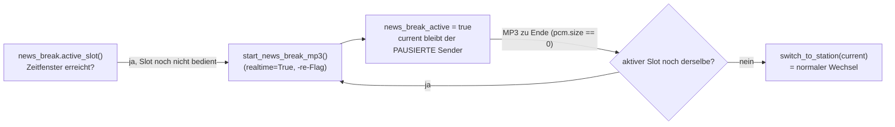

Zwei Punkte, an denen sich das lokale Verhalten von einem Live-Sender
unterscheidet:

- **`current` bleibt während der Pause bewusst der pausierte Sender**,
  nicht ein synthetisches "News"-Objekt — dadurch laufen
  `sync_prebuffer()` und Watchdog mit korrekten Daten weiter, und der
  Resume nutzt einfach `switch_to_station(current)`. Die Web-UI zeigt
  trotzdem korrekt "📰 Nachrichten-Pause": `SwitcherState.current_station()`
  liefert währenddessen eine virtuelle Station (`NEWS_BREAK_STATION_ID`).
- **Lokale Dateien werden von ffmpeg NICHT in Echtzeit gelesen** — anders
  als eine Radio-URL dekodiert ffmpeg eine lokale Datei so schnell wie
  CPU/Disk erlauben. `StreamSource.start(path, realtime=True)` (`-re`) ist
  deshalb für die MP3 PFLICHT (live gemessen: ohne das landet ein 35s-Clip
  in 0,1s statt 35s komplett in den Pipes).

Ein Zeitfenster wird per Slot-ID (`news_break.active_slot()`) höchstens
einmal bedient — MP3-Ende, Fensterablauf und manueller Interrupt markieren
den Slot alle gleichermaßen als "schon dran". **Seit 2026-08-12 bricht ein
Fensterablauf eine laufende MP3 nicht mehr mitten in der Wiedergabe ab**:
`news_break_active` ist ausschließlich dann `True`, wenn bereits
erfolgreich eine MP3 gestartet wurde, der Übergang zurück passiert
ausschließlich noch im `pcm.size == 0`-Zweig (MP3 zu Ende) — eine laufende
MP3 spielt dadurch immer bis zum natürlichen Ende, auch wenn das die Pause
über `window_minutes` hinaus verlängert. Der Nachlade-Check dabei vergleicht
Slot-Identität (`active_slot(cfg) == news_break_served_slot`), nicht nur
einen Wahrheitswert — sonst würde eine ungewöhnlich lange MP3-Kette, die
zufällig ins nächste Halbe-Stunde-Fenster hineinreicht, fälschlich als
"noch dasselbe Fenster" durchgehen.

**Manueller Skip innerhalb der Pause (Nutzer-Wunsch)**: eigener Knopf
"⏭ Andere Pause-MP3" auf der Player-Seite, unabhängig vom bestehenden
"⚡ ZAPPEN!"-Knopf. Wichtige Unterscheidung: `request_skip()`/
`note_news_break_interrupted()` (ZAPPEN) BEENDET eine laufende Pause
komplett und markiert den Slot als bedient — der neue
`request_news_break_skip()`/`pop_news_break_skip_request()` löst
stattdessen einfach `start_news_break_mp3(cfg)` ERNEUT aus, während
`news_break_active` weiter `True` bleibt. Funktioniert ohne Sonderfall,
weil `start_news_break_mp3()` ohnehin für den Erstaufruf gebaut ist:
`source.start(path, realtime=True)` räumt die noch laufende alte MP3
selbst auf (gleiches Verhalten wie beim Wechsel Sender→MP3), und
`news_break.pick_random_mp3(..., recent=news_break_recent_files)`
schließt die gerade zu Ende gebrachte Datei automatisch von der Auswahl
aus (dieselbe Dedup-Liste, die auch normale Wiederholungen über mehrere
Pausen hinweg vermeidet) — ein Skip liefert also so gut wie nie zweimal
hintereinander dieselbe Datei. Im Web-Interface nur klickbar, während
`news_break_active` true ist (`disabled`-Attribut wie bei den
Musiksammlung-Track-Buttons); der Hauptloop ignoriert eine Anfrage
außerhalb einer aktiven Pause zusätzlich selbst (Verteidigung gegen einen
Race zwischen Klick und Pausen-Ende).

### Werbeblock-Vorbuffering (ad_skip_prebuffer.py, seit 2026-08-21)

Optionales Zusatzfeature (`news_break.ad_prebuffer_enabled`, Default
AUS): nach der Pause-MP3 folgt auf vielen Sendern erst ein Werbeblock,
bevor wieder Musik läuft — der Hörer bekäme den live komplett ab. Ein
Live-Stream lässt sich aber nicht schneller als Echtzeit lesen, "vorspulen"
geht nicht. Der Trick ist deshalb, die ohnehin verstreichende Pause-Zeit
doppelt zu nutzen: in den letzten `ad_prebuffer_lead_seconds` der Pause-MP3
schon im Hintergrund auf den pausierten Sender verbinden und mitklassifizieren
(`AdSkipPrebuffer`, eigene `StreamSource` + eigener `SpeechDetector`, siehe
dessen Moduldocstring) — läuft der Werbeblock dort kürzer als die Restzeit,
ist er beim Pause-Ende bereits vorbei.

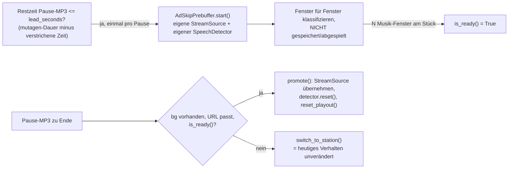

Harte Punkte:

- **Trigger über MP3-Restdauer, nicht über eine feste Fensterposition**:
  `window_minutes` kann durch die "MP3 spielt immer bis zum natürlichen
  Ende"-Regel oben beliebig überschritten werden, ein Trigger relativ zum
  Fenster-Ende wäre also unzuverlässig. `start_news_break_mp3()` liest die
  Dauer stattdessen einmalig per `audio_tags.read_duration_seconds()`
  (mutagen, bereits Projektabhängigkeit) und merkt sich den Startzeitpunkt;
  der Hauptloop berechnet daraus pro Tick die Restzeit. Datei nicht lesbar
  → Trigger bleibt für diese MP3 einfach inaktiv, kein Fehler.
- **Eigene `SpeechDetector`-Instanz zwingend** (siehe deren `reset()`-
  Docstring/Abschnitt "Sprache-Erkennung (VAD)" oben): der Hintergrund-
  Strom und der Hauptloop-Strom laufen gleichzeitig, eine geteilte Instanz
  würde Leftover/Modellzustand beider vermischen.
- **Bewusst NUR VAD, kein STT/Fingerprint**: `SttFilter` lädt pro Instanz
  eigene Sprachmodelle (RAM-Verdopplung bei einer zweiten Instanz),
  `FingerprintDB`-Connections sind laut Abschnitt "Fingerprinting" oben
  exklusiv dem Hauptloop-Thread vorbehalten. Reine VAD-Klassifikation
  reicht, um "ist das noch Sprache" zu beantworten; ist VAD nicht
  verfügbar, bleibt der Hintergrund-Detector dauerhaft "nicht bereit" —
  Feature deaktiviert sich dadurch faktisch selbst.
- **Kein Audio wird zwischengespeichert** — jedes Hintergrund-Fenster wird
  nach der Klassifikation verworfen. Bei der Übernahme (`promote()`) gibt
  es deshalb bewusst KEIN `adopt_windows()` wie beim normalen
  Prebuffering-Wechsel — `reset_playout()` (Passthrough) ist hier
  inhaltlich richtig, nicht nur technisch nötig.
- **`bg.dead` erst NACH `promote()`/`_join()` verlässlich** (gleiches
  Muster wie `PrebufferedSource`): ein hängender Hintergrund-Thread wird
  erst beim Join als tot erkannt, ein Check davor wäre ein Race.
- **Best-Effort, kein hartes Versprechen**: läuft der Werbeblock länger
  als `ad_prebuffer_lead_seconds`, oder liegt der exakte Pause-Ende-
  Zeitpunkt zufällig auf einer kurzen Wortmeldung/einem Jingle des
  Zielsenders (real beim Testen beobachtet — `is_ready()` kann durch ein
  einzelnes Sprache-Fenster zwischen zwei Ticks kurzzeitig wieder `False`
  werden), fällt der Code auf den heutigen Pfad (`switch_to_station()`)
  zurück — keine Verschlechterung gegenüber dem Verhalten ohne dieses
  Feature.
- **`AdSkipPrebuffer.stop()`/`promote()` können den Hauptloop kurz
  blockieren** (bis zu `STREAM_READ_TIMEOUT + 1` ≈ 9s, falls der
  Hintergrund-Thread gerade mitten in einem Read hängt) — dieselbe
  bekannte, akzeptierte Grenze wie bei `PrebufferedSource`/
  `sync_prebuffer()` (siehe "Offene Punkte" unten), nicht neu eingeführt,
  nur an einer weiteren Stelle wirksam.
- **Ressourcen, real gemessen** (`/api/resources`, SESSION.md
  2026-08-21 Phase 3): ein laufender Hintergrund-Reader kostet ~40MB
  zusätzliches RSS (~25MB im Python-Hauptprozess für das zweite geladene
  Silero-VAD-Modell, ~16MB fürs zusätzliche ffmpeg) und ~1 CPU-
  Prozentpunkt on top, jeweils nur für die Dauer von
  `ad_prebuffer_lead_seconds` innerhalb einer Pause — außerhalb einer
  aktiven Pause exakt 0, da `ad_skip_bg` dann `None` ist. Auf dem
  Zielhost (61,95GiB RAM-Limit des Containers) nicht spürbar.

### Sprache-Gate für den Pause-Start (seit 2026-08-21)

Optionales Zusatzfeature (`news_break.require_speech_in_window`, Default
AUS): der Pause-Trigger war bis dahin rein zeitbasiert
(`news_break.active_slot()`) — die Pause konnte dadurch auch starten,
während der Live-Sender noch hörbar Musik spielte. Bei aktiviertem Gate
muss zusätzlich zum normalen Zeitfenster (`window_minutes`) ein eigenes,
meist engeres Toleranzfenster (`speech_gate_window_minutes`, Default 2
Min.) erreicht UND `speech_gate_streak` Analysefenster am Stück als
Sprache klassifiziert worden sein, bevor die Pause tatsächlich startet.

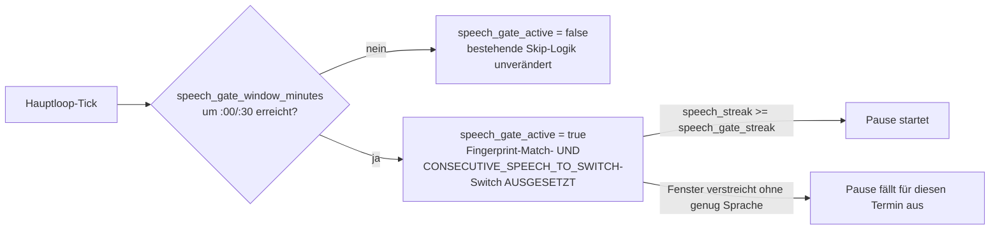

Harte Punkte:

- **Kein Duplikat der Datumsmathematik**: die enge Toleranzprüfung ruft
  `news_break.active_slot()` UNVERÄNDERT mit einer temporär
  überschriebenen Config auf (`{**news_break_cfg, "window_minutes":
  speech_gate_window_minutes}`) — dieselbe Slot-Identität, dieselben
  `enabled`/`enabled_hours`-Regeln, kein eigenständiger, potenziell
  driftender Zweitcode in `news_break.py`.
- **Wiederverwendung von `speech_streak` statt eines zweiten Detectors**:
  das Gate liest denselben, ohnehin pro Tick berechneten Streak-Zähler,
  den auch die bestehende Skip-Logik nutzt — kein zusätzlicher
  Klassifikations-Durchlauf, keine zweite `SpeechDetector`-Instanz nötig
  (anders als beim Werbeblock-Vorbuffering oben, wo zwei PARALLELE
  Audioströme klassifiziert werden — hier läuft alles auf demselben,
  einzigen Live-Strom).
- **Race mit der bestehenden Skip-Logik — real beim Testen gefunden, kein
  theoretisches Risiko**: `speech_streak` wird auch vom Fingerprint-Match-
  Trigger (`FINGERPRINT_TRIGGER_SECONDS=2`) und vom normalen
  "Moderation erkannt"-Trigger (`CONSECUTIVE_SPEECH_TO_SWITCH=3`)
  konsumiert und dabei auf 0 zurückgesetzt — UND ZWAR NOCH IM SELBEN
  Tick, in dem die jeweilige Schwelle erreicht wird. Das Sprache-Gate
  sitzt dagegen am Anfang des NÄCHSTEN Ticks (vor dem Lesen des neuen
  Analysefensters) und hätte den Zähler dadurch fast immer schon wieder
  auf 0 vorgefunden — mit dem ursprünglichen `speech_gate_streak`-Default
  (3, zufällig identisch mit `CONSECUTIVE_SPEECH_TO_SWITCH`) live
  reproduziert: die bestehende "Moderation erkannt"-Logik gewann JEDES
  Mal, das Gate sah nie einen Streak ≥3. Lösung: solange
  `speech_gate_active` true ist (enges Fenster erreicht, Feature an,
  Sabbelfilter an), werden BEIDE bestehenden Trigger (Fingerprint-Match
  UND `CONSECUTIVE_SPEECH_TO_SWITCH`) ausgesetzt — sustained speech soll
  in diesem engen Fenster als "das ist wahrscheinlich die Nachrichten-
  Anmoderation" interpretiert werden, nicht als "das ist Werbung, weg
  damit". Außerhalb des engen Fensters (auch wenn `window_minutes`
  selbst noch träfe) ist die bestehende Skip-Logik komplett unverändert
  aktiv.
- **`speech_gate_window_minutes` sollte ≤ `window_minutes` bleiben** —
  nicht hart erzwungen (gleiche "grobe Leitplanke, keine strenge
  Produktentscheidung"-Philosophie wie bei den übrigen `LIMITS`), aber
  bei einem größeren Wert könnte das enge Fenster theoretisch erreicht
  sein, während der äußere `slot`-Check (der weiterhin zusätzlich geprüft
  wird) noch `None` liefert — der Trigger bleibt dann bis zum äußeren
  Fenster stumm, kein Absturz, nur ein überraschendes Timing bei
  Fehlkonfiguration.
- **Bypass bei deaktiviertem Sabbelfilter**: ohne ihn wird `speech_streak`
  nirgends mehr fortgeschrieben (derselbe `if not state.filter_enabled:
  continue`-Zweig, der auch die restliche Klassifikation überspringt) —
  das Gate würde sonst dauerhaft blockieren, obwohl der Nutzer nur die
  automatische ERKENNUNG abschalten wollte, nicht News-Break selbst.
  Verifiziert: Gate an + Filter aus verhält sich exakt wie Gate aus.
- **Fenster verstreicht ohne genug Sprache**: braucht keinen eigenen
  Code-Pfad — `news_break.active_slot()` liefert danach von selbst
  `None`, die äußere `if slot and ...`-Bedingung greift dann nicht mehr,
  `news_break_served_slot` bleibt unangetastet (wird erst beim
  TATSÄCHLICHEN Pause-Start gesetzt) — keine Gefahr eines doppelten
  Trigger-Versuchs.

## Radio-/Musik-Modus (Top-Level-Fork)

Der Musik-Modus ist **kein** Sonderfall der Nachrichten-Pause (die
pausiert nur einen einzelnen Sender kurz und kehrt automatisch zurück),
sondern ein persistenter Top-Level-Zustand ganz oben im Hauptloop:

Solange `current_mode == "music"` ist, laufen VAD/STT/Fingerprint/
News-Break-Prüfung/Watchdog schlicht nicht — nicht nur pausiert, komplett
aus (Anforderung war "STT/VAD im Musik-Modus komplett aus", nicht nur
pausiert; die beiden Zweige durchflechten zu wollen wäre deutlich
fehleranfälliger gewesen als ein sauberer Fork). Der Übergang radio→music
stoppt `source`, räumt alle Hintergrund-Puffer ab und setzt
`reset_playout()` — eine laufende Nachrichten-Pause wird dabei sauber
beendet. Der Übergang music→radio verbindet frisch zum letzten
`current`-Sender (bleibt während des gesamten Musik-Modus unverändert).
Beide Richtungen persistieren `current_mode` per `settings_store.update()`
**vor** `state.set_mode()` — kein Fenster für "UI zeigt neuen Modus,
Neustart würde aber den alten wiederherstellen".

Programmstart fährt immer erst bedingungslos als Radio hoch
(`source.start()`/`sync_prebuffer()` passieren unabhängig vom Modus), ein
einmaliger Cleanup-Block direkt nach dem Lesen von `state.mode` macht das
danach rückgängig, falls `current_mode` bereits `"music"` war — ein
einzelner Startpfad ist weniger fehleranfällig als zwei.

**Autoresume (seit 2026-08-15)**: beim (Wieder-)Eintritt in den
Player-Modus (Programmstart mit persistiertem `current_mode="music"` ODER
manueller Radio→Musik-Wechsel) startet automatisch Track 0 des
konfigurierten Ordners über einen gemeinsamen `start_folder_playback()`-
Helper (löst `music_library_path` auf, listet Tracks, startet Track 0),
aufgerufen an drei Stellen: Programmstart-Cleanup, manueller Play-Klick
und direkt nach `state.set_mode("music")`. Vorher blieb die Wiedergabe in
beiden Fällen inaktiv, bis manuell auf ▶ getippt wurde — vom Nutzer
fälschlich als "Modus wird nicht gemerkt" wahrgenommen (der Modus lief
schon vorher zu 100% serverseitig über `/api/status`, es gibt im ganzen
Repo keine einzige Verwendung von `localStorage`). Kein Persistieren der
exakten Track-Position — jeder (Wieder-)Eintritt beginnt alphabetisch beim
ersten Track (Nutzervorgabe: "ersten Track bzw. weiterlaufend", nicht
"exakte letzte Stelle merken"). Wichtig: das serverseitige Schreiben in
den Icecast-Mount ist von der Browser-Autoplay-Problematik des
`/musik`-Play-Knopfs (siehe SESSION.md) komplett unabhängig — die betrifft
nur das lokale `<audio>`-Element im Browser, nicht die Streamerzeugung.

Der Musik-Tick selbst (Play/Stop/Zurück/Nächster über
`music_library.list_tracks()`, rekursiv bis zu `MAX_SCAN_DEPTH`=5
Unterordner-Ebenen, zyklische Playlist) schreibt Audio **direkt** über
`write_audio()`, nicht über die Playout-Deque — es gibt im Musik-Modus
nichts zu erkennen, ein Delay hätte keinen Zweck.

## Musik-Library-Baukasten

Vier Module mit klar getrennten Zuständigkeiten — kein Modul kennt die
Aufgabe der anderen:

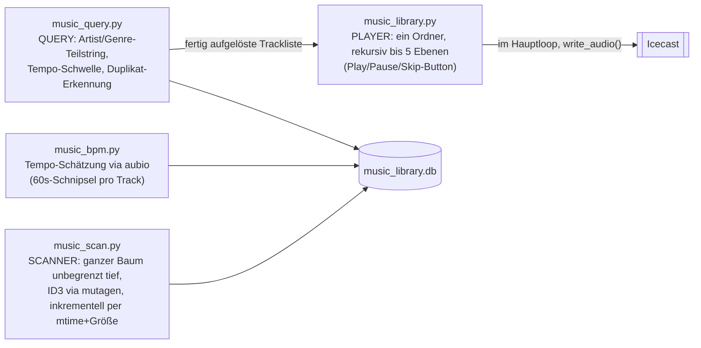

**Scan** (`music_scan.py`, Phase 1) läuft ausschließlich aus dem
Webserver-Thread (`POST /api/library/scan`, Hintergrund-Thread +
Progress-Poll wie `station_import.py`, zweiter Start während eines
laufenden Scans wird mit 409 abgelehnt). Eigene DB
(`music_library.db`, getrennt von `fingerprints.db` — andere Domäne, eine
gemeinsame DB wäre nur zufällige Kopplung). Cover werden als Dateien in
einem eigenen beschreibbaren Mount (`music_library_covers/`) gecacht,
Dateiname = SHA1-Hash des relativen Track-Pfads (kein DB-Lookup nötig, um
zu wissen, wohin ein Re-Scan das Cover schreibt). **Inkrementell per
mtime+Größe**: nur bei Änderung wird tatsächlich mutagen/ID3-APIC gelesen
(teurer Teil) — der erste Scan einer Sammlung bleibt zwangsläufig
langsam, jeder folgende wird massiv billiger. Ein "Gefunden"-Set schützt
vor Fehlbereinigung: eine Datei, die zwar noch auf der Platte liegt aber
gerade nicht lesbar ist (kaputte MP3, kurzer SMB-Hänger), wird trotzdem
zum "gefunden"-Set hinzugefügt (nur das Parsing wird übersprungen) — sonst
würde die Aufräum-Phase einen gültigen DB-Eintrag für eine nur
VORÜBERGEHEND defekte Datei fälschlich als "gelöscht" werten und
entfernen. Upsert läuft über `filepath` (UNIQUE-Constraint).

**Query** (`music_query.py`, Phase 2) läuft ebenfalls nie im Hauptloop —
gleiche Kurzlebige-Connection-Begründung wie bei `fingerprint.py`
(sqlite3 nicht thread-sicher). Bewusst **kein echter Query-Parser**: nur
zwei Filterarten (`query_by_artist()`/`query_by_genre()`, simples
`LIKE '%wert%'`) für eine Handvoll fester Buttons, kein freies
Eingabefeld — Genre-Tags sind ID3-Freitext ohne feste Taxonomie ("Rock"
vs. "Classic Rock"), Teilstring-Match ist die einzige praktikable
Näherung ohne eigene Genre-Normalisierung. "klassik" matcht deshalb NICHT
automatisch "Classical" (keine Synonym-Liste, bewusste Grenze). Ein
Query-Play **ersetzt** eine laufende Wiedergabe sofort (Klick = "ab jetzt
DIESE Playlist"), anders als der große Play-Button, der nur bei Idle
wirkt. Filepath-Auflösung setzt voraus, dass `music_library_path` seit
dem letzten Scan unverändert ist (die DB speichert `filepath` relativ zum
damaligen Root, nicht absolut) — ein Re-Scan nach einer Root-Änderung
behebt das.

**Duplikat-Erkennung** (`music_query.find_duplicates()`) ist reiner
**Metadaten**-Abgleich (normalisiertes Artist+Titel-Paar: klein
geschrieben, Whitespace getrimmt+kollabiert in Python, SQLite kennt kein
eingebautes "mehrere Leerzeichen kollabieren"), KEIN Audio-Fingerprint-
Vergleich (bräuchte eigenen Analyse-Code, bewusst zurückgestellt).
Erkennt dadurch z.B. denselben Song als MP3 UND FLAC, aber NICHT
inhaltlich identisches Audio mit abweichenden/fehlenden Tags. Tracks ohne
Artist ODER Titel werden von der Gruppierung ausgeschlossen (sonst würden
alle untaggten Dateien fälschlich als eine riesige Gruppe erscheinen);
nur Gruppen mit ≥2 Treffern werden zurückgegeben, inklusive Dateigröße
als Entscheidungshilfe. `GET /api/library/duplicates` ist reiner
Lese-Endpoint, bewusst ohne UI-Anschluss (nur Anzeige/Meldung, keine
Lösch-Aktion).

**BPM** (`music_bpm.py`, Phase 3) liefert die Datengrundlage für
`query_by_tempo(db, "fast"|"slow")` mit festen Schwellwerten
(`FAST_BPM_MIN=120`, `SLOW_BPM_MAX=90` in `music_query.py`) — der Bereich
dazwischen fällt bei beiden raus, eine grobe, nachjustierbare Konvention,
keine Musikwissenschaft. **aubio statt librosa** (Nutzer-Entscheidung):
librosa zieht einen sehr schweren Dependency-Baum (numba+llvmlite allein
>100 MB); aubio ist zur Laufzeit sehr leicht (~0,25s pro Track inkl.
ffmpeg-Decode eines 60s-Schnipsels). **aubio 0.4.9 (PyPI, 2019) baut
nicht sauber gegen aktuelles numpy** (live aufgetreten:
`PyUFuncGenericFunction` erwartet seit numpy>=1.22 `const npy_intp*`) —
das Dockerfile lädt den Source-Tarball per `curl` direkt von PyPI
(`pip download` hängt sich in diesem Image an einer isolierten
Build-Umgebung auf), patcht die zwei betroffenen Funktionssignaturen per
`sed` und installiert mit `pip install --no-build-isolation`. Nur ein
60s-Schnipsel wird dekodiert, nicht der komplette Track. BPM-Analyse
läuft im selben Scan-Durchlauf wie das ID3-Parsing; ein dritter Zweig in
`scan_library()` (unverändert + `bpm IS NULL` → nur `UPDATE ... SET bpm`
statt vollem Reparse) sorgt dafür, dass die BPM-Migration auch bereits
gescannte, unveränderte Dateien nachträglich befüllt (`bpm_backfilled`-
Zähler), ohne sie als "unverändert, also überspringen" dauerhaft bei
`bpm=NULL` zu belassen.

**Format-Erweiterung**: `AUDIO_EXTENSIONS` (geteilt zwischen
`music_library.py` und `music_scan.py`) deckt MP3, FLAC, OGG, M4A, rohes
ADTS-AAC, WAV und APE ab. Playback brauchte keine Änderung (ffmpeg ist
container-/codec-agnostisch), die Arbeit steckt in der Metadaten-/
Cover-Extraktion, an echten Testdateien verifiziert:

- FLAC/OGG/MP4 liefern über `mutagen.File(pfad, easy=True)` normalisierte
  Text-Tags; nur die Cover-Extraktion braucht Format-spezifischen Code
  (`_read_cover_bytes()`: FLACs `.pictures`, OGGs Base64-`metadata_block_picture`,
  MP4s `covr`-Atom) — kein gemeinsames mutagen-API dafür.
- **WAV wird von mutagen NICHT "easy"-gewrappt** — `WAVE(pfad).get("artist")`
  liefert IMMER `None`, obwohl ID3-Tags unter rohen Frame-IDs (`TPE1`)
  durchaus vorhanden sein können.
- **Rohes ADTS-AAC**: mutagens Auto-Erkennung erkennt eine getaggte
  `.aac`-Datei FÄLSCHLICH als MP3 (wegen des ID3v2-Headers) und crasht am
  MPEG-Frame-Sync (`HeaderNotFoundError`, live reproduziert) — ohne
  Sonderbehandlung wäre jede getaggte AAC-Datei bei jedem Scan als Fehler
  markiert und nie eingelesen worden.
- **APE hat kein standardisiertes Cover-Feld** — Cover-Extraktion wird
  dafür bewusst nicht versucht. **Nicht gegen eine echte `.ape`-Datei
  verifiziert** (siehe "Offene Punkte" unten): das Image-ffmpeg hat einen
  Decoder, aber keinen Encoder für Monkey's Audio.

`audio_tags.py` bündelt die dafür nötige format-übergreifende Weiche
(`RawId3EasyAdapter` für WAV/AAC, `open_tags()`, `extract_year()`) und
wird von zwei Seiten genutzt: `music_scan.py` (Scan) UND dem Hauptloop
(`radiosabbelnich.py`s `start_music_track()`/`start_news_break_mp3()`) für
die **Live-Tag-Anzeige während der Wiedergabe** — Titel/Interpret/Album/
Jahr, mit Fallback-Kaskade (fehlender Titel-Tag → Dateiname; fehlende
weitere Felder → `None`, Darstellung entscheidet der Aufrufer). Aufruf
passiert einmal PRO TRACK-START, nicht im ~1s-Analysetakt. Bewusst EIN
Codepfad für Ordner- UND Query-Modus (frischer Read von der Datei statt
der in `music_query.py` bereits vorhandenen DB-Werte) statt zweier
divergierender Pfade. Kein Cover, keine Restzeit/Dauer in der Anzeige
(siehe "Offene Punkte" unten).

## STT-Sprachfilter (stt_filter.py)

Zusätzliches Signal per Speech-to-Text, komplett unabhängig von
`fingerprint.py`: wo VAD/Heuristik nur "menschliche Stimme" erkennen
(Gesang zählt da mit), prüft `stt_filter.py` den Inhalt.

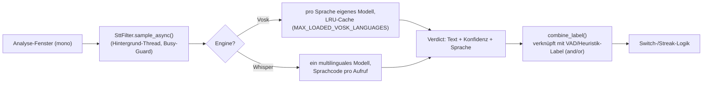

Die einzige Kopplungsstelle mit der bestehenden Switch-Logik ist
`stt_filter.combine_label()`, eingehängt in die `classify()`-Closure in
`main()` — Streak-Zählung/Fingerprint-Trigger/`do_switch()` bleiben
dadurch unverändert, Fingerprint merkt von alldem nichts.

**Mehrsprachigkeit**: die erwartete Sprache hängt an der **Kategorie**
des laufenden Senders (`settings_store.resolve_stt_language()`), nicht am
einzelnen Sender — der Hauptloop reicht dasselbe `stt_lang` an
`stt.sample_async()` (Sampling-Ziel) UND `classify()` (Verdict-
Interpretation) weiter, sonst würde z.B. im ersten Fenster nach einem
Kategoriewechsel mit falscher Sprache gesampelt. `_fresh_verdict()` prüft
neben dem Alter auch, ob das Sprach-Tag des Verdicts zu
`expected_language` passt — sonst würde ein noch nicht abgelaufener
Befund einer VORHERIGEN Sprache fälschlich mit der Schwelle der neuen
Sprache bewertet.

**Engine-Asymmetrie bestimmt die Architektur**: Whisper ist multilingual
(ein geladenes Modell, Sprachcode nur pro `transcribe()`-Aufruf) — eine
zusätzliche Sprache kostet dort kein zusätzliches RAM. Vosk braucht ein
komplett eigenes Modell PRO Sprache, deshalb Lazy-Load
(`_get_vosk_engine()`) plus `MAX_LOADED_VOSK_LANGUAGES` (Default 2) als
LRU-Cache. Sowohl Erfolg ALS AUCH Fehlschlag werden gecacht
(Fehlertext statt `_VoskEngine`-Objekt), damit ein kaputter Modellpfad
nicht bei jedem Sample-Tick erneut das Dateisystem anfasst.
Engine-Reload bei laufendem Sample ist sicher: `sample_async()` kopiert
die Engine-Referenz lokal in den Thread, bevor `reload()` sie austauschen
kann — ein bereits laufender Sample läuft sauber zu Ende.

Sampling läuft kontinuierlich (nicht nur bei VAD-Label "speech"), sonst
wäre `combine_mode="or"` wirkungslos — pausiert nur während
`news_break_active` und wenn der Filter global deaktiviert ist. Ohne
(passenden/frischen) Befund ist `combine_label()` ein reines No-Op und
gibt das VAD-Label unverändert zurück — dadurch deaktiviert sich das
Feature bei einem Modell-Ladefehler faktisch selbst.

Konfidenzwerte sind **Best-Effort-Proxys, keine kalibrierten
Wahrscheinlichkeiten** (Vosk: echte Wort-Konfidenz nur bei manchen
Modellen, sonst Wortanzahl-Proxy; Whisper: gar keine Sprache-Konfidenz,
nur `1 - no_speech_prob` als Näherung). Gemessen am
`vosk-model-small-de-0.15`-Default gegen echte Sender:
Deutschlandfunk-Sprache nie unter 0.83, Schlager-Gesang im Schnitt 0.38 —
`confidence_threshold=0.75` (Default) liegt mit Marge dazwischen. Klar/
langsam gesungener Schlager erzeugt aber gelegentlich kurze, grammatisch
plausible Wortfetzen mit hoher Konfidenz (~20% der gemessenen
Schlager-Clips lagen trotzdem über 0.75) — `combine_mode="and"`
reduziert das deutlich, ist aber kein Allheilmittel (siehe "Offene
Punkte" unten).

Ein geführter **Kalibrierungs-Wizard** hilft bei der Schwellwertwahl pro
Sprache: `SwitcherState` hält dafür `_calibration` (Sprache/Stufe/beide
Sample-Listen) bewusst OHNE request/pop, weil eine Kalibrierungs-Session
keinen der Player-kritischen Zustände berührt — der Webserver-Thread
schreibt direkt lock-geschützt, der Hauptloop hängt per
`add_calibration_sample()` an. Ist eine Session aktiv, erzwingt der
Hauptloop ihre Sprache als STT-Ziel UND pausiert die komplette Switch-/
Streak-Logik für den Tick — sonst könnte ein durch die Kalibrierungssprache
verfälschtes `combine_label()`-Ergebnis mitten in der Kalibrierung einen
automatischen Wechsel auslösen. `add_calibration_sample()` verwirft
Samples ohne erkannten Text (leerer Text = "keine Wort-Hypothese",
semantisch etwas anderes als "niedrige Konfidenz" — beides ungefiltert
zieht `speech_min` künstlich auf 0). `suggest_confidence_threshold()`
schlägt die Grenze zwischen `max(music_samples)` und `min(speech_samples)`
vor (`_THRESHOLD_MARGIN_RATIO=0.7` Richtung Sprache gewichtet); der Wizard
schaltet selbst NIEMALS einen Sender um.

## Mehrsprachiges Web-Interface (i18n.py)

`i18n.py` ist reine Domänenlogik, übersetzt ausschließlich das, was der
Nutzer im Browser sieht (Labels, Buttons, `alert()`/`confirm()`) — Logs,
Code-Kommentare und die von den `*_store.py`-Modulen geworfenen
`ValueError`-Texte bleiben deutsch.

Englisch ist die im Code eingebettete Basissprache (`_BASE_STRINGS`,
immer vollständig). Weitere Sprachen kommen als externe `.lng`-
Sprachpakete aus `language/` (Key=Value, `#!code=`/`#!name=`-Metazeilen)
— gewählt statt JSON, weil alle Strings Ein-Zeiler ohne echte
Zeilenumbrüche sind und Key=Value ohne Anführungszeichen-Escaping von
Hand editierbar bleibt. Eine `.lng`-Datei muss NICHT vollständig sein:
`_discover_languages()` merged pro Sprache `_BASE_STRINGS` mit den in der
Datei gefundenen Keys, ein fehlender Key fällt für GENAU diesen Key auf
Englisch zurück statt die ganze Sprache scheitern zu lassen.

Beide Templates (`_PAGE_HTML`/`_CONFIG_PAGE_HTML`) bleiben je ein
Quelltext mit `data-i18n*`-Attributen, einmal PRO SPRACHE beim
Modul-Import vorgerendert (`_render_i18n_variants()`, drei Platzhalter
ersetzt) statt pro Request neu — `do_GET` wählt nur per
`state.language`-Lookup aus den fertigen `_PAGE_HTML_BYTES`.
`_check_i18n_coverage()` läuft beim selben Modul-Import: ein Regex
sammelt alle verwendeten `data-i18n*`/`t('key'`-Keys und gleicht sie
gegen `i18n.STRINGS` ab — wirft sofort beim Start bei einem fehlenden/
vertippten Key (übernimmt hier die Rolle des fehlenden Test-Frameworks).
Der Regex für `t('key'` braucht zwingend ein Lookbehind
(`(?<![A-Za-z0-9_])t\('`), sonst matcht er in jedem Bezeichner, der
zufällig auf "t(" endet (`document.createElemen`**`t('`**`div')`, real
aufgetreten).

`language` läuft über denselben request/pop-Zyklus wie andere
`settings_store`-Felder, aber OHNE Neustart (reiner Dict-Lookup statt
Socket-Rewrap wie bei `tls_enabled`) — die Config-Seite lädt sich nach
dem Speichern trotzdem per `location.reload()` neu, weil ein
Sprachwechsel ohne Reload nur die bereits injizierten `I18N`-Strings der
aktuell offenen Seite treffen würde. `DEFAULT_LANGUAGE` (aus
`UI_LANGUAGE` in `.env`) wirkt nur bei einer Neuinstallation ohne
bestehende `settings.json`.

## Automatische Update-Prüfung (update_check.py)

Die Docker-Installation läuft ausschließlich per `git clone`/`git pull` —
es gibt kein Image-Registry-Deployment. `update_check.UpdateChecker` ist
ein reiner Lese-Hintergrund-Thread, der alle 24h prüft, ob die `VERSION`-
Datei im `main`-Branch (per `raw.githubusercontent.com`, unversioniert)
weiter ist als die im Container gebackene lokale Version — kein Aufruf
löst je ein `git pull`/`docker pull` selbst aus, das bleibt vollständig
manuell (siehe README, "Automatische Update-Prüfung").

**Wiederverwendung der bestehenden `VERSION`-Datei statt einer neuen
`version.json`**: `VERSION` (Repo-Root) wird laut `CLAUDE.md`
("Versionspflege") ohnehin bei JEDEM Commit gepflegt (SemVer-Präfix
`vMAJOR.MINOR.PATCH`) — sie ist damit schon die Quelle der Wahrheit für
"ist `main` weiter als mein Checkout". Eine zweite, separat gepflegte
Versionsdatei hätte nur das Risiko geschaffen, dass beide auseinander-
laufen. Der "was ist neu"-Link im Update-Banner zeigt deshalb fest auf
den GitHub-`CHANGELOG.md`-Blob (`update_check.CHANGELOG_URL`) statt aus
einer Remote-JSON gelesen zu werden.

**State-Persistenz über einen neuen `update_check`-Block in
`settings.json`** statt einer eigenen Datei: `settings_store.py` folgt
für `last_checked_at`/`last_known_remote_version`/`update_available`
demselben `DEFAULTS`-Unterblock-Muster wie `news_break`/`stt_filter`/
`song_recognition` (siehe "Song-Erkennung" oben — die dortige Regel zu
neuen Default-Keys, die nie automatisch in eine bestehende
`settings.json` nachgetragen werden, gilt hier identisch). Vorteil
gegenüber einer eigenen Datei: kein neues Bind-Mount in
`docker-compose.yml`, kein neuer `touch`-Schritt beim Setup — `settings.
json` ist ohnehin schon gemountet. `record_update_check_result()` ist
dabei bewusst eine EIGENE Funktion neben `update()`: sie kommt aus dem
Hintergrund-Thread, nicht aus einem validierten Nutzer-Request, und
schreibt nur die drei State-Felder, nie `enabled` (das bleibt
ausschließlich über die Config-Seite steuerbar).

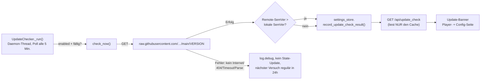

**Kein Live-Check im Request-Handler**: `GET /api/update_check` liest
ausschließlich den zuletzt persistierten `update_check`-Block aus
`settings.json`, macht selbst NIE einen Netzwerk-Request — ein
Seitenaufruf des Web-Interfaces darf nie auf GitHub warten (Latenz,
Ausfälle), das ist strikt Aufgabe des Hintergrund-Threads. Aus demselben
Grund läuft der Thread nur innerhalb von `start_server()` (also nur bei
`webui_port != 0`, siehe `radiosabbelnich.py main()`,
`if args.webui_port:`) — ein isolierter Testlauf mit `--webui-port 0`
(siehe CLAUDE.md-Testmuster) bekommt dadurch automatisch KEINEN
Hintergrund-Thread und macht keinen ungewollten echten Internet-Request.

**Poll-Intervall des Threads (5 Min.) ≠ Check-Intervall (24h)**: der
Thread wacht alle 5 Minuten auf und prüft nur, ob `enabled` UND
`last_checked_at` fällig sind, statt einmal pro Start in einen einzelnen
24h-`sleep()` zu gehen — ein Deaktivieren über die Config-Seite wirkt
dadurch binnen Minuten statt erst nach bis zu 24h nach. `last_checked_at`
wird beim Thread-Start aus der persistierten `settings.json` gelesen
(nicht bei jedem Container-Neustart auf `None` zurückgesetzt), damit
häufige `docker compose up -d --build`-Zyklen während der Entwicklung
nicht bei jedem Neustart einen frischen GitHub-Request auslösen.

**Default AN, bewusste Ausnahme von der sonstigen "Default AUS"-
Konvention** (siehe README für den Nutzer-seitigen Hinweis): anders als
STT/Fingerprinting/Song-Erkennung kostet dieses Feature keine laufende
CPU/RAM, nur alle 24h einen einzelnen HTTP-GET — reiner Lesezugriff ohne
jeden Eingriff in den Radiobetrieb, das Risiko/Nutzen-Verhältnis ist
grundsätzlich anders als bei aktiv Erkennung betreibenden Features.

## Docker: Host- vs. Container-Layout

Host-Layout und Container-Layout sind bewusst entkoppelt — im Container
landet unabhängig von der Host-Ordnerstruktur alles flach in `/app/`:

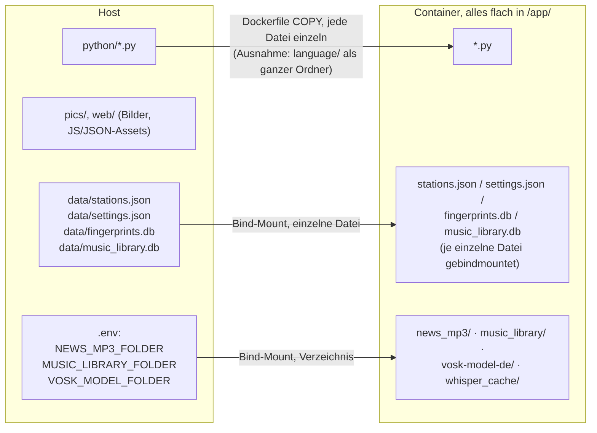

`_load_static()`/`STATIONS_FILE`/`SETTINGS_FILE`/`FINGERPRINT_DB_FILE`/
`DEFAULT_LOG_FILE` sind alle `__file__`-relativ zum jeweiligen
`.py`-Modul — wer eine neue Datei hinzufügt, muss nur den **Host-Pfad**
(Dockerfile-`COPY`-Quelle bzw. linke Seite eines Volume-Mounts) der
Ordnerstruktur folgen lassen, das Container-interne Ziel bleibt immer
flach.

- `stations.json`/`settings.json`/`fingerprints.db` sind als **einzelne
  Dateien** gebindmountet. Deshalb schreibt `stations_store._write()`
  direkt statt über `os.replace()` — ein Rename über einen Mountpoint
  scheitert mit "Device or resource busy". Nicht auf "atomares
  Schreiben" umbauen.
- Der Dockerfile kopiert jede `.py`-Datei **einzeln**: neue Module dort
  eintragen, sonst fehlen sie im Image. `language/` (siehe i18n oben) ist
  die eine bewusste Ausnahme (`COPY language/ language/`) — `i18n.py`
  durchsucht den Ordner zur Laufzeit per `glob`, eine neue Sprachdatei
  soll durch bloßes Ablegen + Rebuild wirken, ohne eine eigene COPY-Zeile
  zu brauchen (sonst fehlt die Sprache im Image lautlos statt mit Fehler).
- `fix_silero_execstack.py` patcht zur Build-Zeit das PT_GNU_STACK-Bit der
  silero-vad-lite-`.so`. Ohne den Patch verweigert der Kernel dieses
  Hosts das `dlopen()` und die Spracherkennung fällt dauerhaft auf die
  Heuristik zurück.
- Der Icecast-Service überschreibt den Entrypoint des Basis-Images
  (`icegen` kennt `<location>`/`<admin>` nicht, und ohne
  `rm -f icecast.xml` hängt es bei jedem Neustart eine zweite Kopie an →
  ungültiges XML, Absturzschleife).
- `news_break.mp3_folder`/`music_library.path` in `settings.json` sind
  **Container-interne** Pfade (Default `/app/news_mp3` bzw.
  `/app/music_library`), nicht die Host-Pfade — letztere kommen über
  `NEWS_MP3_FOLDER`/`MUSIC_LIBRARY_FOLDER` in `.env` rein. Beide Mounts
  sind zusätzlich die festen Roots für die Breadcrumb-Ordnerauswahl
  (`webui._BROWSE_ROOTS`, `folder_browse.py`) — ein neuer dritter
  "Browse-Root" bräuchte dort einen weiteren Eintrag plus Bind-Mount.
  `folder_browse.py` selbst kennt keinen der beiden Config-Keys, nur
  einen festen Root und einen relativen Unterpfad; `rel_path` wird per
  `realpath()` + Prefix-Check gegen Verzeichnis-Traversal abgesichert und
  fällt bei einem Versuch (geloggt) auf den Root zurück.

## TLS/HTTPS (optional, `TLS_CERT_FILE`/`TLS_KEY_FILE` in `.env`)

Beide Dienste bekommen bei Bedarf HTTPS, aber auf grundverschiedene Art:

- **Web-Interface** (`webui.start_server()`): `settings.json`-Feld
  `tls_enabled` entscheidet, ob das Server-Socket in
  `ssl.SSLContext.wrap_socket()` eingewickelt wird — nur beim Start
  gelesen (ein `ThreadingHTTPServer` kann sein Socket nicht live neu
  einwickeln, wirkt also erst nach Container-Neustart). Kein
  Parallelbetrieb: sobald aktiv, läuft nur noch HTTPS. Fehlt das
  Zertifikat trotz `tls_enabled=true`, fängt `start_server()` den
  `ssl.SSLError` ab und bleibt bei HTTP statt abzustürzen.
- **Icecast**: kein Python-Code, kein `settings.json`-Bezug — separater
  Drittanbieter-Container, gesteuert über `.env`. Sind
  `TLS_CERT_FILE`/`TLS_KEY_FILE` gesetzt, patcht das `command:`-Skript in
  `docker-compose.yml` einen **zusätzlichen** SSL-`<listen-socket>` in
  die generierte `icecast.xml` (Port `ICECAST_SSL_PORT`, Default 8443) —
  der bestehende Klartext-Port bleibt unverändert. Icecast braucht dafür
  kurz Root, um die 0600-Zertifikatsdatei zu lesen, gibt die Rechte
  danach über `<security><changeowner>` selbst wieder ab. **Der
  icegen-Generator hat dabei einen Bug**: er trägt `<group>icecast2</group>`
  ein, tatsächlich heißt im Image die Gruppe `icecast` (nur der User
  heißt `icecast2`, uid/gid sind zufällig beide 101) — ohne `sed`-Fix
  verweigert Icecast als root generell den Start, unabhängig davon, ob
  überhaupt ein Zertifikat konfiguriert ist. Zusätzlich reicht Icecast
  eine `<ssl-certificate>` mit getrennten Cert-/Key-Dateien nicht: beide
  werden zu einer PEM-Datei zusammengefügt (`cat cert key >
  icecast-tls.pem`) und explizit auf `icecast2:icecast` gechownt, weil
  Icecast diese Datei nachweislich erst **nach** dem internen
  Privilegien-Drop liest, nicht währenddessen als root (per isoliertem
  Testcontainer verifiziert) — root-only 0600 hätte dort nicht gereicht.
- Beide Mounts fallen ohne gesetzte `TLS_CERT_FILE`/`TLS_KEY_FILE` auf
  `/dev/null` zurück statt auf eine Repo-Platzhalterdatei — `/dev/null`
  ist auf jedem Host ein gültiges Bind-Mount-Ziel und liefert 0 Byte,
  genau das, was die jeweiligen "ist überhaupt ein Zertifikat
  da?"-Prüfungen erwarten.

## Sicherheitsmodell

Web-Interface und Config-Seite haben keinerlei Authentifizierung. Die
volle Begründung und die daraus folgende Verhaltensregel für
Codeänderungen stehen als Direktive in `CLAUDE.md` ("Kein Auth, nur
hinter VPN") — hier nur der architekturelle Fakt: es gibt keinen
Auth-Layer vor `webui.py`, jeder mit Netzwerkzugriff auf Port 5000/8000
hat vollen Zugriff.

## Offene Punkte

- `sync_prebuffer()`/`pb.stop()` können den Hauptloop blockieren (bis
  ~9 s pro Quelle, siehe Prebuffering oben).
- Das Web-Interface zeigt keinen Stream-Health-Status.
- Die Fingerprint-DB wächst ohne Pruning. Gleiches gilt für die
  `song_fingerprints.db` (Song-Erkennung) — zusätzlich läuft deren Matching
  per Brute-Force gegen ALLE gecachten Songs, was nur bis zu einigen
  hundert/tausend Einträgen praktikabel bleibt (kein Index/keine
  Kandidaten-Vorauswahl). `similarity_threshold` (Default 0.65) ist
  weiterhin ein Platzhalter, noch nicht gegen echtes Stream-Audio
  kalibriert — das bisherige `song_match_log`-Kalibrierungs-Logging ist
  dafür ungeeignet (tautologisch, siehe Abschnitt "Song-Erkennung" oben);
  die seit Phase 2 verfügbaren AudD-Identifikationen wären die bessere
  Datenquelle, werden dafür aber noch nicht automatisiert ausgewertet.
  AudD-Cloud-Lookup (Phase 2) selbst ist implementiert (inkl. Album/Jahr
  seit dem entsprechenden Nutzer-Wunsch, siehe SESSION.md), aber: keine
  Vorbefüllung der Referenz-DB aus eigenen ID3-Tags (separates, größeres
  Vorhaben, siehe README-Roadmap-Notiz), und der feste 60s-Cooldown
  (`AUDD_MIN_INTERVAL_SECONDS`) ist eine grobe
  Sicherheitsleitplanke, kein echtes Kontingent-Tracking (kein Tages-
  Limit-Zähler o.ä.). Das Hörer-Gate (`ListenerGate`) pollt ebenfalls nur
  alle 60s (`LISTENER_CHECK_INTERVAL_SECONDS`) — nach einem frischen
  Hörer-Zulauf kann es dadurch bis zu 60s dauern, bis Song-Erkennung
  überhaupt wieder anspringt, PLUS danach `snippet_seconds`, bis der beim
  Stop geleerte Ringpuffer wieder voll ist (siehe "Stop statt Pause" oben)
  — kein Instant-Trigger auf den ersten Client-Connect.
- Die Config-Seite skaliert nicht auf mehrere hundert Sender (keine
  Suche, kein Bulk-Delete).
- STT-Sprachfilter: `confidence_threshold=0.75` ist an einem kleinen
  echten Sample (Deutschlandfunk + 3 Schlager-Sender) kalibriert, klar/
  langsam gesungener Schlager bleibt eine bekannte Schwachstelle (~20%
  falsch-positive Konfidenz trotz Schwelle). Whisper wurde noch gar
  nicht gegen echtes Audio getestet. `suggest_confidence_threshold()`s
  Formel ist bislang nur an den ursprünglichen DE-Messwerten
  plausibilisiert, nicht an einer zweiten Sprache in echtem Betrieb
  verifiziert — bei sehr kleinen Sample-Zahlen bleibt der Vorschlag
  entsprechend grob (die Web-UI warnt bei überlappenden Verteilungen).
- Das Playout-Delay schützt Hörer nur bei Wechseln zu vorgewärmten
  Sendern — bei einem frischen Wechsel läuft der Sender bis zum
  nächsten warmen Wechsel ohne Delay/Vorausschau, bewusst in Kauf
  genommen statt eines gapless-Übergangs, der ohne Zeitdehnung nicht
  möglich ist.
- Musik-Modus: schnell/langsam-Buttons sind seit Phase 3 (BPM) nutzbar,
  rock/klassik/Queen/Pavarotti seit Phase 2 (Query). Die APE-
  Unterstützung ist mangels Encoder im Image NICHT gegen eine echte
  `.ape`-Datei verifiziert — nur Playback (ffmpeg-Decoder vorhanden) und
  Text-Tag-Extraktion sind plausibilisiert. Eine während des Musik-Modus
  eigentlich fällige Nachrichten-Pause wird beim Rückweg zu Radio NICHT
  nachgeholt (die Slot-Prüfung läuft im Musik-Modus nicht mit) —
  bewusste Grenze, kein Bug. Die Preflight-/Start-Checks in
  `radiosabbelnich.sh` prüfen `MUSIC_LIBRARY_FOLDER` bislang NICHT wie
  `NEWS_MP3_FOLDER` (Existenz/Lesbarkeit/Dateianzahl) — ein leerer/
  fehlender Ordner liefert beim Play-Klick nur keine Tracks statt eines
  Fehlers.
- Die Tag-Anzeige während der Wiedergabe deckt bewusst nur Titel/
  Interpret/Album/Jahr ab, kein Cover und keine Restzeit/Dauer — Cover
  bräuchte einen neuen Endpoint samt On-the-fly-Extraktion für Dateien
  außerhalb der gescannten `music_library.db` (News-Break-Ordner wird
  nie gescannt), Restzeit bräuchte zusätzlich einen tickenden
  Client-Timer, nicht nur den rohen `mutagen`-Dauerwert.
